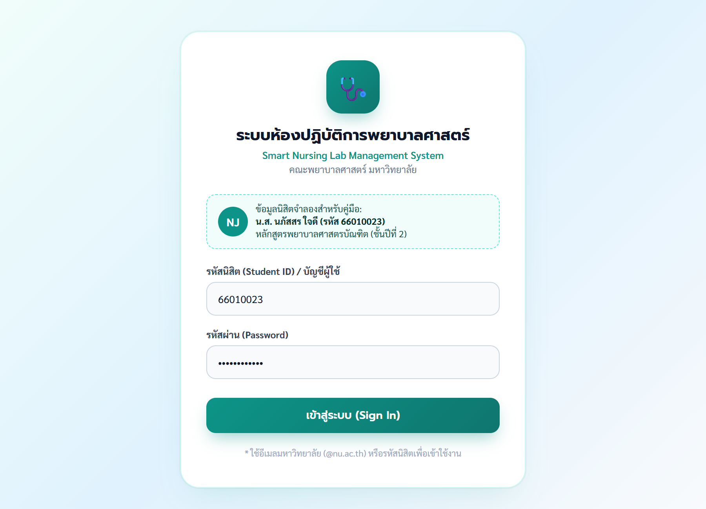
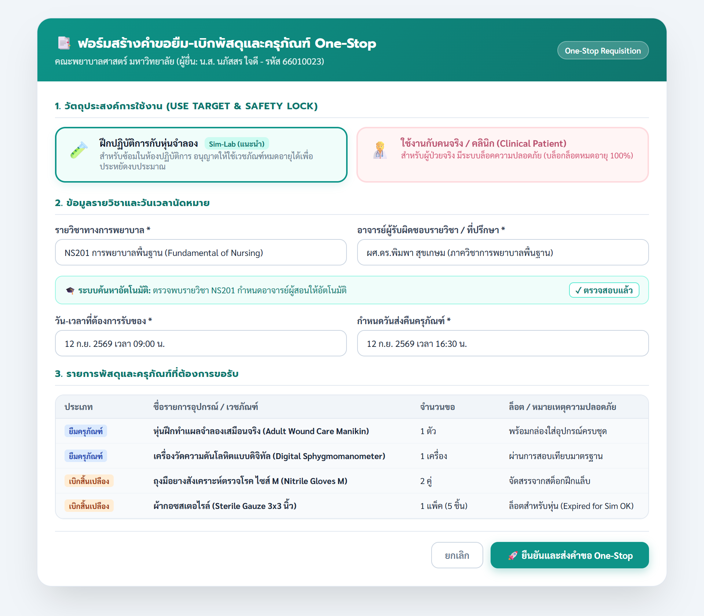
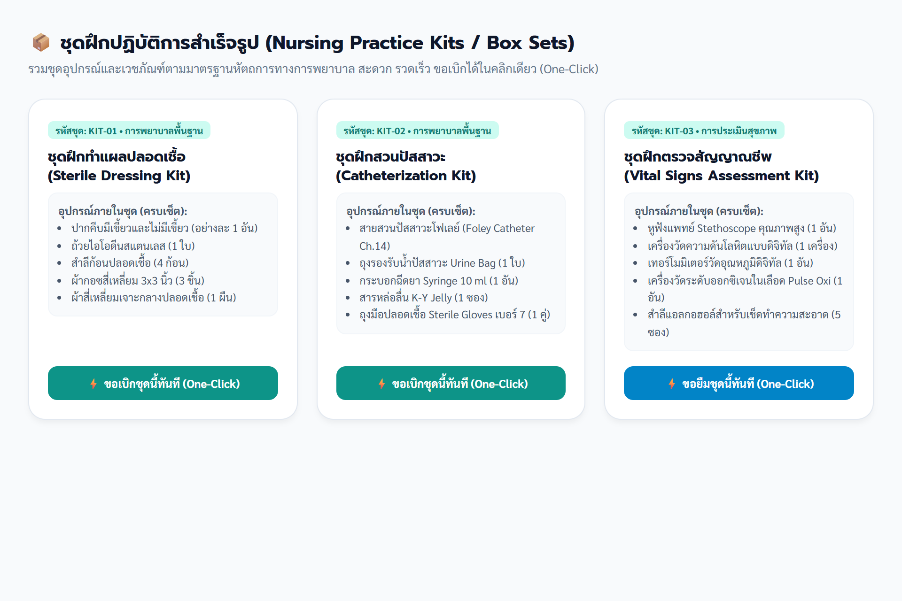
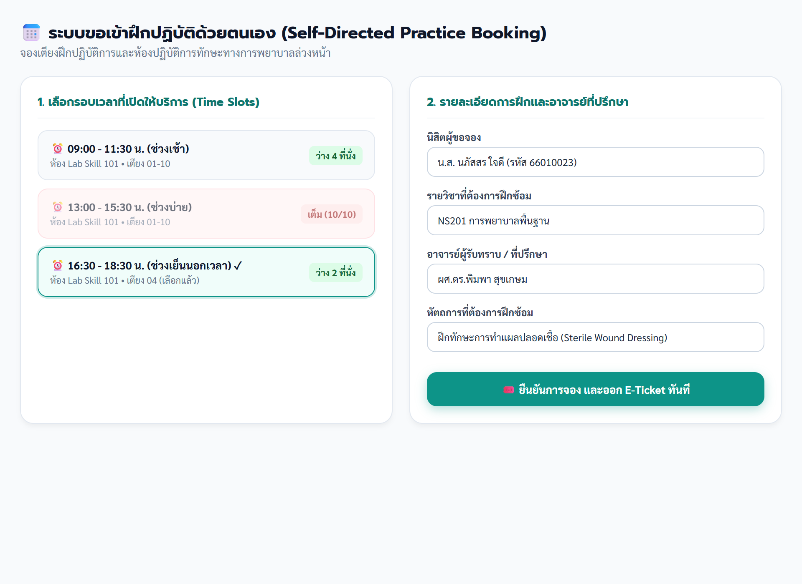

# คู่มือการใช้งานระบบบริหารจัดการห้องปฏิบัติการพยาบาลศาสตร์
## สำหรับนิสิตพยาบาล (Student User Manual)
### Smart Nursing Lab Management System • คณะพยาบาลศาสตร์

---

## สารบัญ (Table of Contents)
1. [บทนำและวัตถุประสงค์ของระบบ](#บทนำและวัตถุประสงค์ของระบบ)
2. [บทที่ 1: การเข้าสู่ระบบและการเตรียมความพร้อม](#บทที่-1-การเข้าสู่ระบบและการเตรียมความพร้อม)
3. [บทที่ 2: ผังงานขั้นตอนการทำงานมาตรฐาน (Standard Flowcharts)](#บทที่-2-ผังงานขั้นตอนการทำงานมาตรฐาน-standard-flowcharts)
   - [2.1 ผังงานภาพรวมการใช้งานของนิสิต (Overall Student Lifecycle)](#21-ผังงานภาพรวมการใช้งานของนิสิต)
   - [2.2 ผังงานการยืม-เบิกแบบ One-Stop และระบบ Patient Safety Lock](#22-ผังงานการยืม-เบิกแบบ-one-stop-และระบบ-patient-safety-lock)
   - [2.3 ผังงานการจองห้องแล็บและระบบสแกน QR Code Check-in](#23-ผังงานการจองห้องแล็บและระบบสแกน-qr-code-check-in)
4. [บทที่ 3: ขั้นตอนการยืม-คืนครุภัณฑ์ และเบิกพัสดุสิ้นเปลือง (One-Stop Requisition)](#บทที่-3-ขั้นตอนการยืม-คืนครุภัณฑ์-และเบิกพัสดุสิ้นเปลือง)
5. [บทที่ 4: การขอเบิกชุดฝึกปฏิบัติการสำเร็จรูป (Nursing Practice Kits)](#บทที่-4-การขอเบิกชุดฝึกปฏิบัติการสำเร็จรูป)
6. [บทที่ 5: การขอเข้าฝึกปฏิบัติการด้วยตนเองและสแกน QR Code (Self-Practice & QR Check-in)](#บทที่-5-การขอเข้าฝึกปฏิบัติการด้วยตนเองและสแกน-qr-code)
7. [บทที่ 6: การส่งคืนอุปกรณ์และการปฏิบัติตามกฎความปลอดภัย (Return Guidelines & Safety)](#บทที่-6-การส่งคืนอุปกรณ์และการปฏิบัติตามกฎความปลอดภัย)

---

## บทนำและวัตถุประสงค์ของระบบ

ระบบบริหารจัดการห้องปฏิบัติการพยาบาลศาสตร์ (Smart Nursing Lab Management System) ได้รับการพัฒนาขึ้นเพื่อยกระดับการให้บริการแก่นิสิตพยาบาลศาสตร์ ในการฝึกทักษะทางการพยาบาลทั้งในห้องปฏิบัติการเสมือน (Simulation Lab) และการเตรียมพร้อมฝึกปฏิบัติการบนหอผู้ป่วยจริง (Clinical Practice) โดยมีวัตถุประสงค์หลัก ดังนี้:

1. **One-Stop Service:** รวมขั้นตอนการยืมครุภัณฑ์และการเบิกเวชภัณฑ์สิ้นเปลืองไว้ในคำขอเดียว ลดความซ้ำซ้อนและประหยัดเวลาของนิสิต
2. **Patient Safety Lock (มาตรการความปลอดภัยผู้ป่วย):** แยกวัตถุประสงค์การใช้งานระหว่าง "การฝึกกับหุ่นจำลอง (Sim-Lab)" ซึ่งอนุญาตให้ใช้วัสดุหมดอายุได้เพื่อประหยัดงบประมาณ กับ "การใช้งานกับคนจริง (Clinical Patient)" ซึ่งระบบจะบล็อกและคัดกรองเฉพาะเวชภัณฑ์ที่ยังไม่หมดอายุ 100%
3. **Practice Room Booking & Digital Check-in:** อำนวยความสะดวกให้นิสิตสามารถจองห้องปฏิบัติการและเตียงฝึกทักษะนอกเวลา พร้อมออกบัตร Digital E-Ticket และระบบสแกน QR Code เช็คอินเข้าห้องฝึกอย่างเป็นระบบ

---

## บทที่ 1: การเข้าสู่ระบบและการเตรียมความพร้อม

### 1.1 การเข้าใช้งานระบบ
1. เข้าใช้งานผ่านเว็บเบราว์เซอร์ (รองรับทั้งคอมพิวเตอร์ แท็บเล็ต และสมาร์ทโฟน) ที่ URL ประจำคณะพยาบาลศาสตร์
2. หน้าจอเข้าสู่ระบบจะปรากฏขึ้นดังรูปที่ 1.1

*รูปที่ 1.1: หน้าจอเข้าสู่ระบบสำหรับนิสิตพยาบาล (Student Login)*

### 1.2 ข้อมูลสำหรับเข้าสู่ระบบ (Student Persona จำลอง)
* **บัญชีผู้ใช้ / รหัสนิสิต:** ระบุรหัสนิสิต 8 หลัก (เช่น `66010023`) หรืออีเมลมหาวิทยาลัย
* **รหัสผ่าน:** รหัสผ่านบัญชีนิสิตมหาวิทยาลัย
* **ข้อมูลตัวอย่างในคู่มือ:**
  * **ชื่อ-นามสกุล:** น.ส. นภัสสร ใจดี
  * **รหัสนิสิต:** 66010023
  * **ระดับการศึกษา:** พยาบาลศาสตรบัณฑิต ชั้นปีที่ 2
  * **รายวิชาหลัก:** NS201 การพยาบาลพื้นฐาน (Fundamental of Nursing)

---

## บทที่ 2: ผังงานขั้นตอนการทำงานมาตรฐาน (Standard Flowcharts)

ผังงานในคู่มือนี้จัดทำขึ้นตามมาตรฐานสากล **ISO 5807 / ANSI Information Processing Flowchart Symbols** โดยมีสัญลักษณ์มาตรฐานดังนี้:

| สัญลักษณ์ | ชื่อเรียกทางเทคนิค | ความหมายในการใช้งาน |
| :---: | :--- | :--- |
|  | **Terminator (วงรี/แคปซูล)** | จุดเริ่มต้น (Start) หรือจุดสิ้นสุด (End) ของกระบวนการ |
|  | **Process (สี่เหลี่ยมผืนผ้า)** | การปฏิบัติงาน กิจกรรม หรือการประมวลผลของระบบ |
|  | **Decision (สี่เหลี่ยมข้าวหลามตัด)** | จุดตัดสินใจเงื่อนไข เช่น ผ่าน/ไม่ผ่าน, อนุมัติ/ไม่อนุมัติ (มีกิ่ง Yes/No) |
|  | **Data / I/O (สี่เหลี่ยมด้านขนาน)** | การรับข้อมูลนำเข้าจากผู้ใช้ หรือการแสดงผลลัพธ์ข้อมูล |
|  | **Document (เอกสาร)** | การออกเอกสาร บัตรคิว หรือ E-Ticket พร้อม QR Code |

---

### 2.1 ผังงานภาพรวมการใช้งานของนิสิต
แสดงขั้นตอนตั้งแต่การล็อกอินเข้าสู่ระบบ การเลือกประเภทบริการ (ยืม-เบิก One-Stop, ชุด Kit สำเร็จรูป หรือ จองห้องแล็บ) จนถึงการส่งคืนและเสร็จสิ้นขั้นตอน

*ผังงานที่ 1: ภาพรวมกระบวนการใช้งานระบบของนิสิตพยาบาล (Overall Student Lifecycle)*

---

### 2.2 ผังงานการยืม-เบิกแบบ One-Stop และระบบ Patient Safety Lock
แสดงกลไกการแยกวัตถุประสงค์การใช้งาน การตรวจสอบวันหมดอายุ และการอนุมัติแบบสองระดับ (อาจารย์ผู้สอนรับทราบ -> เจ้าหน้าที่ห้องแล็บอนุมัติ)

*ผังงานที่ 2: ขั้นตอนการยืม-เบิกแบบ One-Stop และกลไก Patient Safety Lock*

---

### 2.3 ผังงานการจองห้องแล็บและระบบสแกน QR Code Check-in
แสดงกระบวนการจองห้องปฏิบัติการทักษะทางการพยาบาล การเลือกเตียงและรอบเวลา (Time Slots) การออก Digital E-Ticket และการสแกน QR Code หน้าห้องแล็บ

*ผังงานที่ 3: ขั้นตอนการจองห้องปฏิบัติการพยาบาลและการสแกน Check-in*

---

## บทที่ 3: ขั้นตอนการยืม-คืนครุภัณฑ์ และเบิกพัสดุสิ้นเปลือง

ระบบรองรับการสร้างคำขอ **One-Stop Requisition** ซึ่งรวมรายการครุภัณฑ์ (ยืม-คืน) และเวชภัณฑ์สิ้นเปลือง (เบิกใช้หมดไป) ไว้ในใบคำขอเดียวกัน

*รูปที่ 3.1: หน้าต่างสร้างคำขอยืม-เบิกแบบ One-Stop (Unified Requisition Modal)*

### 3.1 ขั้นตอนการกรอกแบบฟอร์ม
1. **กดปุ่ม "+ ขอยืม-เบิกอุปกรณ์ (One-Stop)"** บนหน้าจอหลัก
2. **เลือกวัตถุประสงค์การใช้งาน (Use Target):**
   * **🧪 ฝึกปฏิบัติการกับหุ่นจำลอง (Sim-Lab) [แนะนำ]:** ระบบจะอนุญาตให้เบิกเวชภัณฑ์ที่หมดอายุแล้วสำหรับการฝึกซ้อมได้ ช่วยประหยัดงบประมาณของคณะ
   * **🧑‍⚕️ ใช้งานกับคนจริง / คลินิก (Clinical Patient):** สำหรับหัตถการกับผู้ป่วยจริง **ระบบ Patient Safety Lock จะทำงานทันที** โดยระบบจะบล็อกล็อตที่หมดอายุ และอนุญาตให้เบิกเฉพาะล็อตที่ยังไม่หมดอายุเท่านั้น
3. **เลือกรหัสรายวิชาทางการพยาบาล:**
   * ตัวอย่าง: เลือก `NS201 การพยาบาลพื้นฐาน (Fundamental of Nursing)`
   * **จุดเด่นระบบอัตโนมัติ:** เมื่อเลือกวิชาแล้ว ระบบจะดึงชื่ออาจารย์ผู้รับผิดชอบรายวิชา (เช่น *ผศ.ดร.พิมพา สุขเกษม*) ให้อัตโนมัติ นิสิตไม่ต้องค้นหาเอง
4. **กำหนดวัน-เวลานัดหมาย:**
   * ระบุวันและเวลาที่ต้องการมารับอุปกรณ์ที่ห้องแล็บ
   * ระบุวันและเวลากำหนดส่งคืนครุภัณฑ์
5. **เลือกรายการอุปกรณ์:**
   * **รายการครุภัณฑ์ที่ยืม:** เช่น หุ่นฝึกทำแผลจำลองเสมือนจริง 1 ตัว, เครื่องวัดความดันโลหิตแบบดิจิทัล 1 เครื่อง
   * **รายการเวชภัณฑ์สิ้นเปลืองที่ขอเบิก:** เช่น ถุงมือยางสังเคราะห์ตรวจโรค 2 คู่, ผ้ากอซสเตอไรล์ 1 แพ็ค
6. **กดปุ่ม "🚀 ยืนยันและส่งคำขอ One-Stop"**

### 3.2 สถานะของคำขอ (Request Statuses)
* 🟡 `PENDING_ADVISOR` : ส่งคำขอแล้ว อยู่ระหว่างรออาจารย์ประจำวิชากดรับทราบ
* 🔵 `PENDING_OFFICER` : อาจารย์รับทราบแล้ว อยู่ระหว่างเจ้าหน้าที่ห้องแล็บจัดสรรของ
* 🟢 `APPROVED` : คำขอได้รับอนุมัติแล้ว นิสิตสามารถเดินทางมารับของตามวันนัดหมาย
* 🔴 `REJECTED` : คำขอไม่ได้รับอนุมัติ (สามารถตรวจสอบเหตุผลที่เจ้าหน้าที่ระบุไว้ในระบบ)
* 🟣 `DISPENSED` : นิสิตรับอุปกรณ์ไปใช้งานแล้ว
* 🟢 `RETURNED` : นิสิตส่งคืนครุภัณฑ์เรียบร้อย สภาพสมบูรณ์

---

## บทที่ 4: การขอเบิกชุดฝึกปฏิบัติการสำเร็จรูป

เพื่อความสะดวกและรวดเร็ว ระบบได้จัดเตรียม **ชุดฝึกปฏิบัติการสำเร็จรูป (Nursing Practice Kits / Box Sets)** สำหรับหัตถการมาตรฐาน ทำให้นิสิตไม่ต้องเลือกอุปกรณ์ทีละชิ้น

*รูปที่ 4.1: หน้าต่างเลือกชุดฝึกปฏิบัติการสำเร็จรูป (Nursing Practice Kits)*

### 4.1 ตัวอย่างชุดฝึกหัตถการยอดนิยม
1. **ชุดฝึกทำแผลปลอดเชื้อ (Sterile Dressing Kit - รหัส KIT-01):**
   * บรรจุ: ปากคีบมีเขี้ยวและไม่มีเขี้ยว, ถ้วยไอโอดีนสแตนเลส, สำลีก้อนปลอดเชื้อ, กอซสี่เหลี่ยม 3x3 นิ้ว, ผ้าสี่เหลี่ยมเจาะกลาง
2. **ชุดฝึกสวนปัสสาวะ (Catheterization Kit - รหัส KIT-02):**
   * บรรจุ: Foley Catheter Ch.14, ถุง Urine Bag, กระบอกฉีดยา 10 ml, สารหล่อลื่น K-Y Jelly, ถุงมือ Sterile เบอร์ 7
3. **ชุดฝึกตรวจสัญญาณชีพ (Vital Signs Assessment Kit - รหัส KIT-03):**
   * บรรจุ: Stethoscope, เครื่องวัดความดันโลหิต, เทอร์โมมิเตอร์ดิจิทัล, Pulse Oximeter, แอลกอฮอล์แพ็ค

### 4.2 วิธีการขอเบิกแบบคลิกเดียว (One-Click Request)
1. เข้าเมนู **"ชุดฝึกปฏิบัติการ (Practice Kits)"**
2. เลือกชุดฝึกที่ต้องการตามหัตถการในบทเรียน
3. กดปุ่ม **"⚡ ขอเบิกชุดนี้ทันที (One-Click)"**
4. ระบบจะสร้างคำขอเบิกอุปกรณ์และดึงรายชื่อเวชภัณฑ์ทั้งหมดในกล่องให้อัตโนมัติ นิสิตเพียงระบุรายวิชาและกดยืนยัน

---

## บทที่ 5: การขอเข้าฝึกปฏิบัติการด้วยตนเองและสแกน QR Code

สำหรับนิสิตที่ต้องการฝึกซ้อมทักษะนอกเวลาเรียน หรือเตรียมความพร้อมก่อนการสอบประเมินทักษะ OSCE สามารถจองห้องปฏิบัติการและเตียงฝึกผ่านระบบได้

*รูปที่ 5.1: หน้าจอจองห้องปฏิบัติการและรอบเวลา (Time Slots Booking)*

### 5.1 ขั้นตอนการจองห้องปฏิบัติการ
1. เข้าเมนู **"ขอเข้าฝึกปฏิบัติด้วยตนเอง (Self-Practice Booking)"**
2. เลือกห้องปฏิบัติการ เช่น **ห้อง Lab Skill 101**
3. เลือกรอบเวลา (Time Slot) ที่เปิดให้บริการ:
   * 🟢 รอบที่มีที่นั่งว่าง: แสดงจำนวนที่นั่งว่าง (เช่น ว่าง 2 ที่นั่ง) สามารถกดจองได้
   * 🔴 รอบที่เต็ม: แสดงป้ายสีแดง "เต็ม (10/10)" ไม่สามารถจองได้
4. ระบุรายวิชา วัตถุประสงค์ในการฝึก และเลือกเตียงปฏิบัติการ
5. กดยืนยันการจอง ระบบจะออก **Digital E-Ticket** ให้ทันที

*รูปที่ 5.2: บัตรเข้าห้องปฏิบัติการ Digital E-Ticket พร้อม QR Code Check-in*

### 5.2 ขั้นตอนการ Check-in สแกนเข้าห้องแล็บ
1. เดินทางมาถึงหน้าห้องปฏิบัติการก่อนเวลาเริ่มฝึกอย่างน้อย 5 นาที
2. นำสมาร์ทโฟนเปิดหน้า **Digital E-Ticket** ของตนเอง
3. ใช้กล้องหรือเครื่องสแกนหน้าห้องปฏิบัติการ สแกน QR Code เพื่อ Check-in
4. เมื่อระบบตรวจสอบความถูกต้องสำเร็จ สถานะจะเปลี่ยนเป็น `IN_PRACTICE`
5. ระบบจะเริ่มจับเวลาและสะสม **"ชั่วโมงฝึกปฏิบัติการส่วนบุคคล"** เข้าสู่ประวัติของนิสิตโดยอัตโนมัติ

---

## บทที่ 6: การส่งคืนอุปกรณ์และการปฏิบัติตามกฎความปลอดภัย

### 6.1 ขั้นตอนการส่งคืนครุภัณฑ์
1. ทำความสะอาดอุปกรณ์และจัดเก็บเข้ากล่องให้เรียบร้อยตามตำแหน่งเดิม
2. นำอุปกรณ์ส่งคืน ณ เคาน์เตอร์ห้องปฏิบัติการตามวัน-เวลาที่กำหนด
3. เจ้าหน้าที่ห้องแล็บจะตรวจสอบความสมบูรณ์และจำนวนอุปกรณ์:
   * **กรณีสภาพสมบูรณ์ครบถ้วน:** เจ้าหน้าที่จะกดรับคืนในระบบ สถานะเปลี่ยนเป็น `RETURNED`
   * **กรณีพบการชำรุดหรือสูญหาย:** เจ้าหน้าที่จะบันทึกข้อบกพร่องและแจ้งนิสิตเพื่อปฏิบัติตามระเบียบของคณะต่อไป

### 6.2 กฎความปลอดภัยในห้องปฏิบัติการพยาบาลศาสตร์ (Safety Rules)
1. ห้ามนำเวชภัณฑ์ที่มีป้ายกำกับ **"สำหรับฝึกกับหุ่นจำลองเท่านั้น (For Simulation Only)"** ไปใช้กับผู้ป่วยจริงโดยเด็ดขาด
2. นิสิตต้องสวมชุดปฏิบัติการพยาบาลหรือเสื้อกาวน์สะอาด พร้อมติดบัตรประจำตัวทุกครั้งที่เข้าใช้ห้องแล็บ
3. หากพบอุปกรณ์การแพทย์ชำรุด สายไฟขาด หรือหุ่นจำลองขัดข้อง ให้แจ้งเจ้าหน้าที่ประจำห้องแล็บทันที ห้ามแก้ไขหรือซ่อมแซมเอง
4. การทิ้งขยะติดเชื้อและเข็มฉีดยา ต้องทิ้งลงในถังขยะติดเชื้อสีแดงและกล่องทิ้งของมีคม (Sharp Box) ตามมาตรฐาน IC (Infection Control)

---
*จัดทำโดย: งานห้องปฏิบัติการและเทคโนโลยีการศึกษา คณะพยาบาลศาสตร์*
*ระบบ Smart Nursing Lab Management System • เอกสารเวอร์ชัน 2.0 (กันยายน 2569)*
