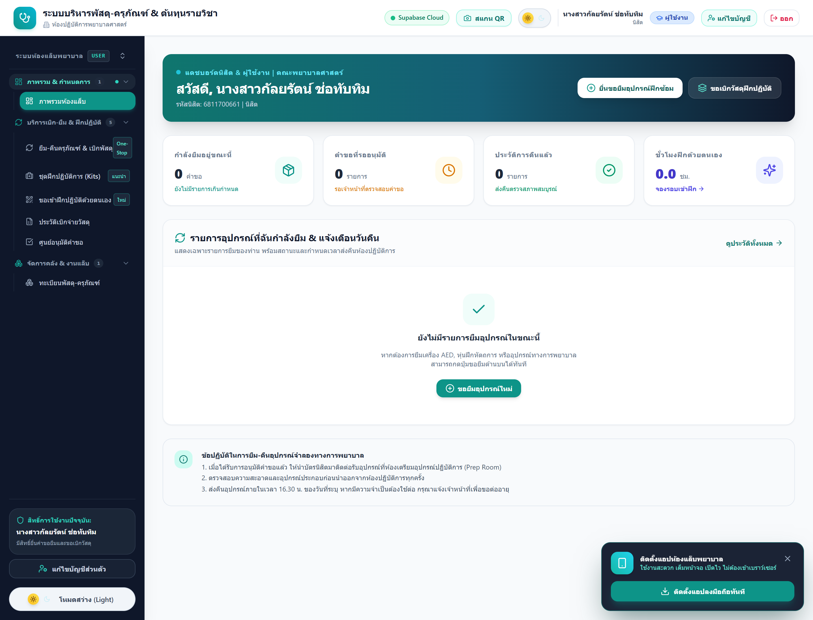
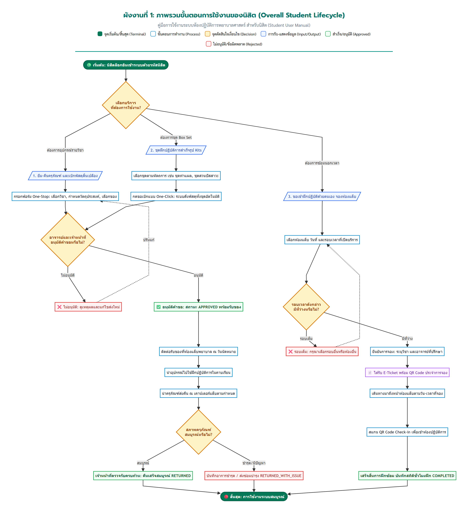
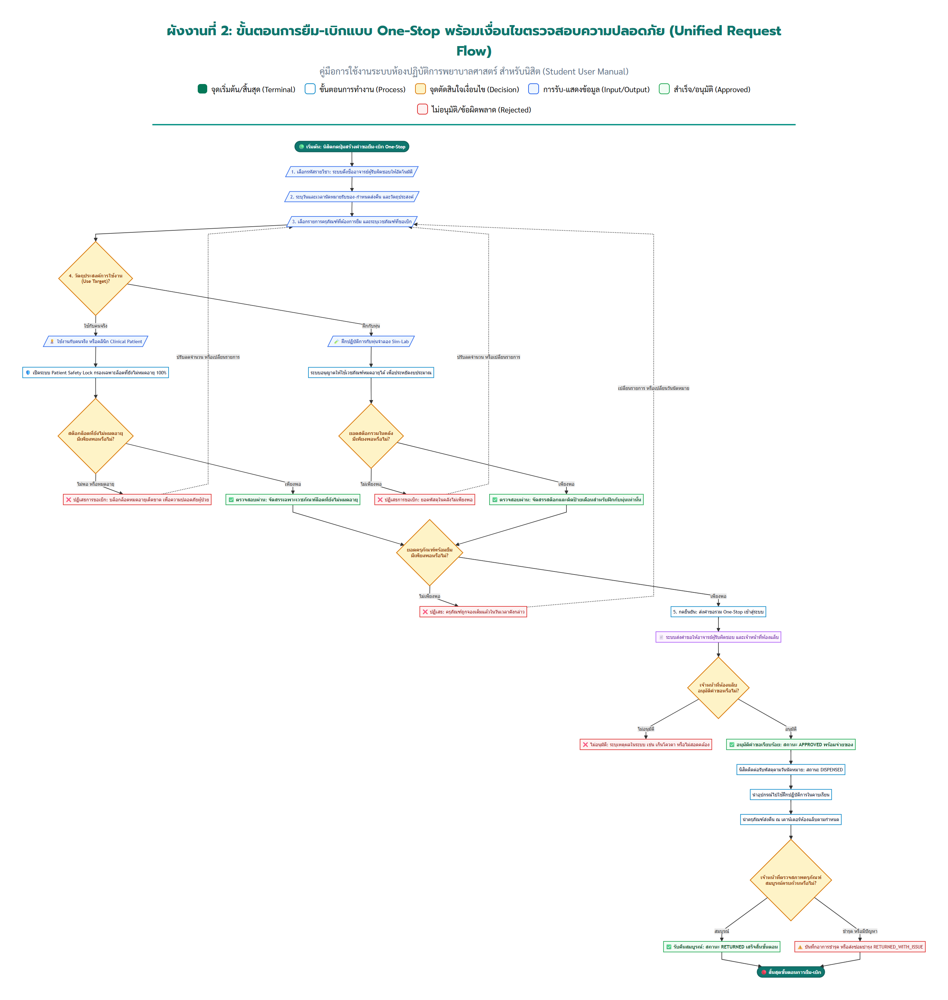
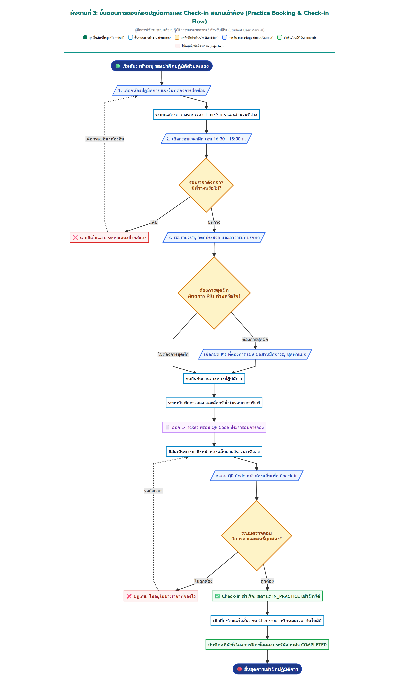
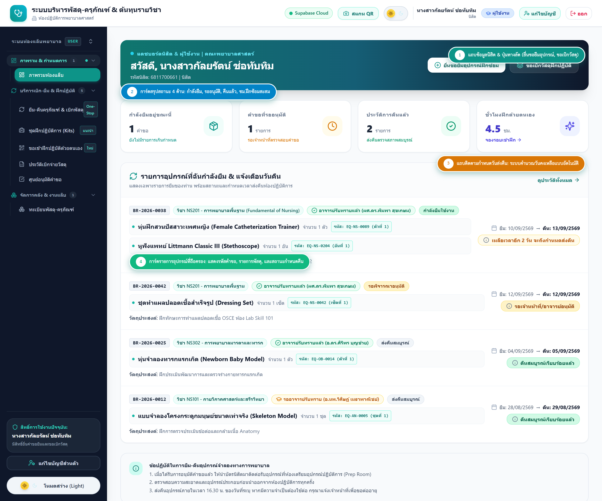
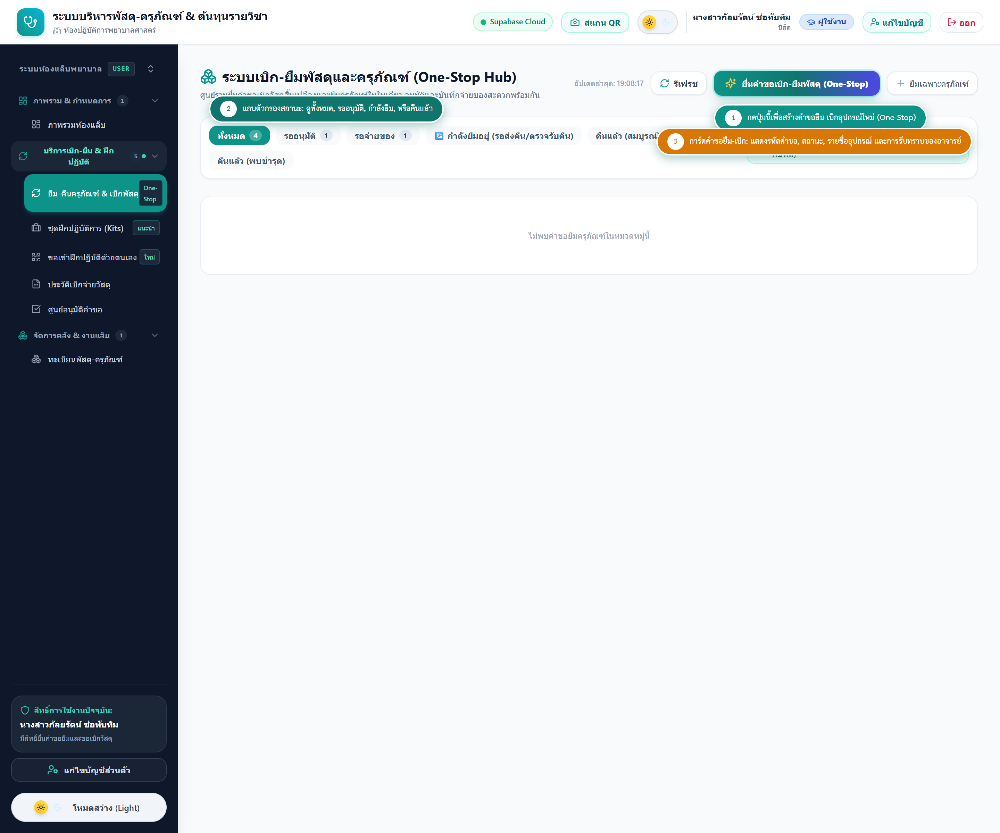
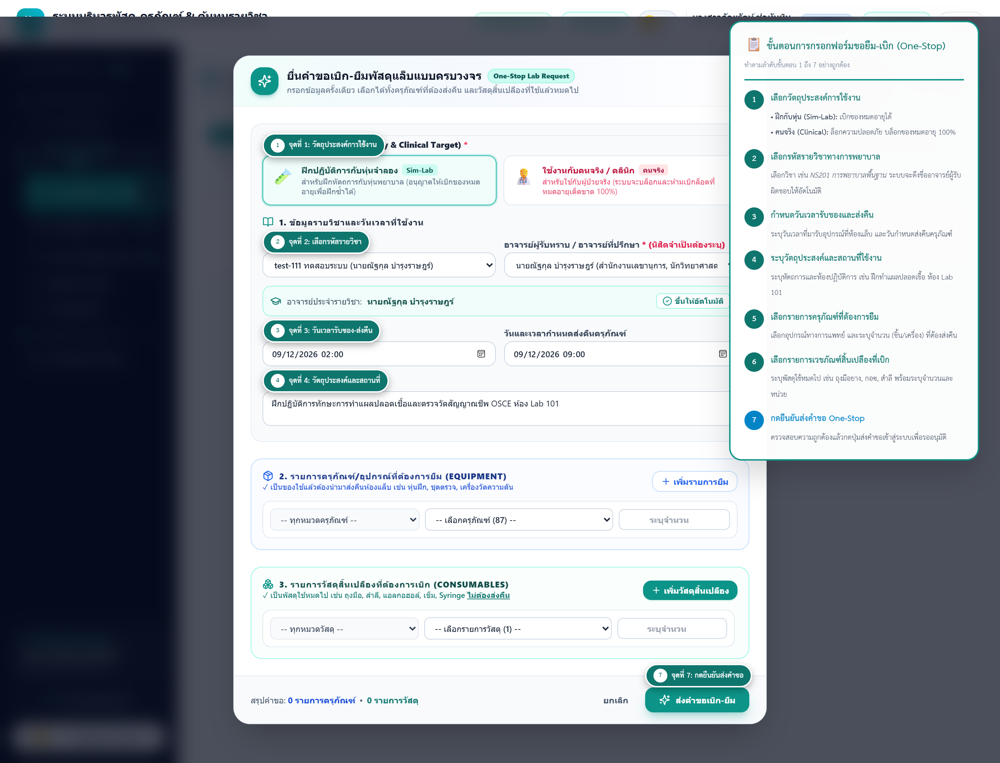
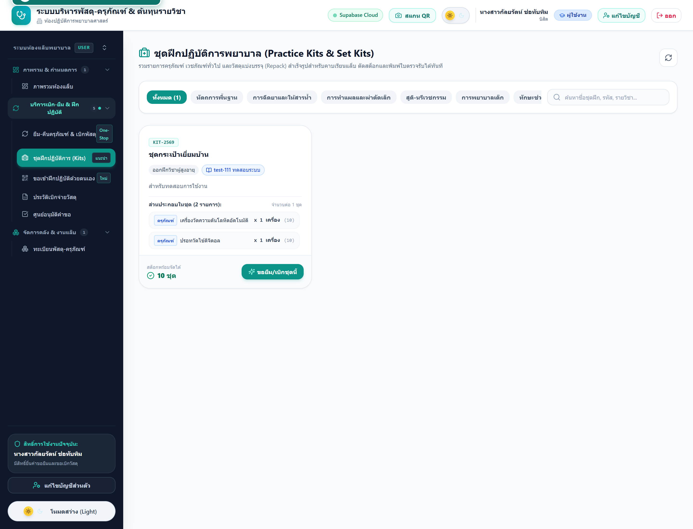
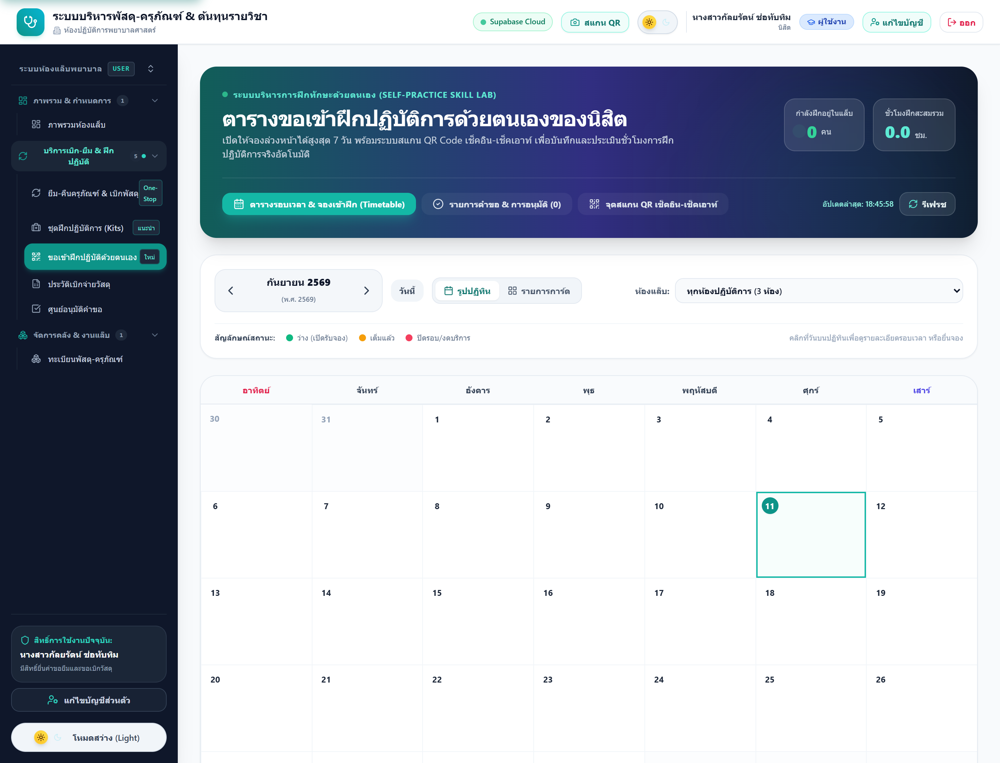
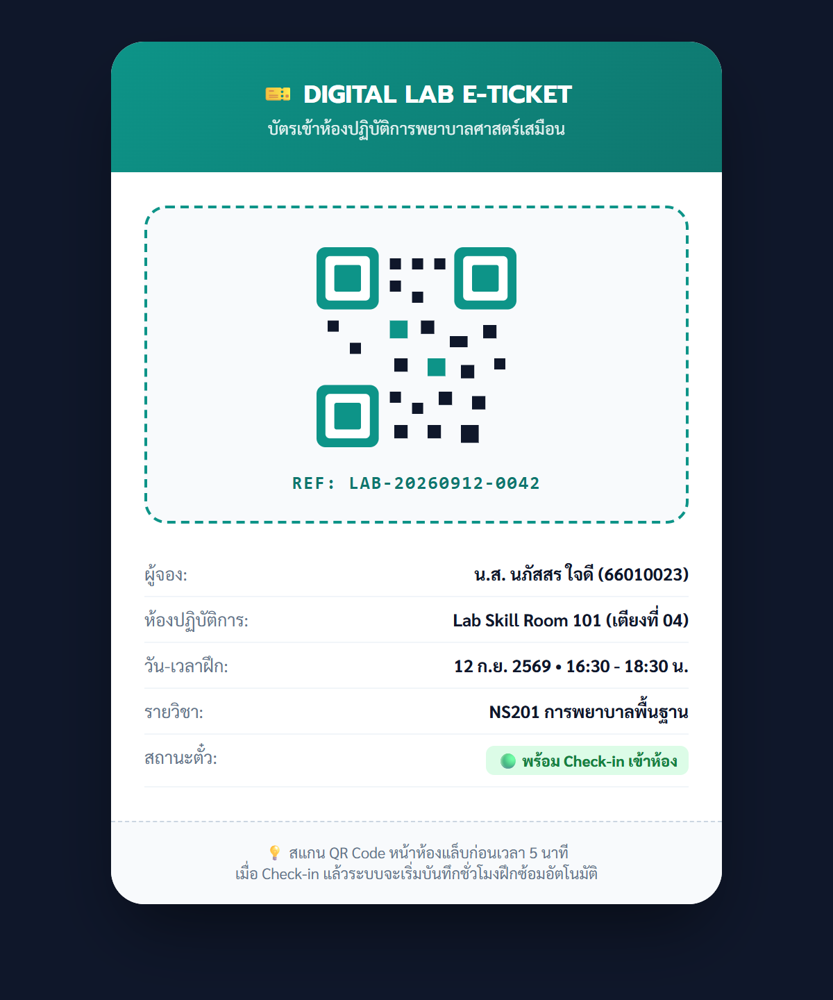

# คู่มือการใช้งานระบบบริหารจัดการห้องปฏิบัติการพยาบาลศาสตร์
## สำหรับนิสิตพยาบาลศาสตร์ (Student User Manual)
### ฟอนต์มาตรฐาน: TH Sarabun PSK ขนาด 16 pt • ภาพประกอบจากระบบจริงพร้อมขั้นตอน 1 2 3 4 อย่างละเอียด

---

## สารบัญ (Table of Contents)
1. [บทที่ 1: การเข้าสู่ระบบ (Student Login)](#บทที่-1-การเข้าสู่ระบบ-student-login)
2. [บทที่ 2: ผังงานขั้นตอนการทำงานมาตรฐาน (Standard Flowcharts เส้นตรงไม่โค้ง)](#บทที่-2-ผังงานขั้นตอนการทำงานมาตรฐาน-standard-flowcharts-เส้นตรงไม่โค้ง)
   - [2.1 ผังงานภาพรวมการใช้งานของนิสิต (Overall Student Lifecycle)](#21-ผังงานภาพรวมการใช้งานของนิสิต)
   - [2.2 ผังงานการยืม-เบิกแบบ One-Stop และระบบ Patient Safety Lock](#22-ผังงานการยืม-เบิกแบบ-one-stop-และระบบ-patient-safety-lock)
   - [2.3 ผังงานการจองห้องปฏิบัติการและระบบสแกน QR Code Check-in](#23-ผังงานการจองห้องปฏิบัติการและระบบสแกน-qr-code-check-in)
3. [บทที่ 3: หน้าจอแดชบอร์ดหลักของนิสิต (Student Main Dashboard)](#บทที่-3-หน้าจอแดชบอร์ดหลักของนิสิต-student-main-dashboard)
4. [บทที่ 4: ภาพรวมรายการคำขอและขั้นตอนการยืม-เบิกแบบ One-Stop (ชี้จุดกรอก 1 ถึง 7)](#บทที่-4-ภาพรวมรายการคำขอและขั้นตอนการยืม-เบิกแบบ-one-stop-ชี้จุดกรอก-1-ถึง-7)
5. [บทที่ 5: การขอเบิกชุดฝึกปฏิบัติการสำเร็จรูป (Nursing Practice Kits)](#บทที่-5-การขอเบิกชุดฝึกปฏิบัติการสำเร็จรูป-nursing-practice-kits)
6. [บทที่ 6: การขอเข้าฝึกปฏิบัติการด้วยตนเองและสแกน QR Code (Self-Practice & QR Check-in)](#บทที่-6-การขอเข้าฝึกปฏิบัติการด้วยตนเองและสแกน-qr-code)
7. [บทที่ 7: การส่งคืนอุปกรณ์และข้อปฏิบัติความปลอดภัย (Return Guidelines & Patient Safety)](#บทที่-7-การส่งคืนอุปกรณ์และข้อปฏิบัติความปลอดภัย)

---

## บทที่ 1: การเข้าสู่ระบบ (Student Login)

นิสิตสามารถเข้าใช้งานระบบได้ผ่านเว็บเบราว์เซอร์ โดยเข้าสู่หน้าจอเข้าสู่ระบบและทำตามขั้นตอนดังนี้:

*รูปที่ 1.1: ภาพจากระบบจริง - ขั้นตอนการกรอกข้อมูลเข้าสู่ระบบ (ขั้นตอนที่ 1 ถึง 3)*

### ขั้นตอนการปฏิบัติ:
* **ขั้นตอนที่ 1 (กรอกรหัสนิสิต):** กรอกรหัสนิสิต 10 หลัก (เช่น `6811700661`) หรืออีเมลมหาวิทยาลัย (@ku.th)
* **ขั้นตอนที่ 2 (กรอกรหัสผ่าน):** กรอกรหัสผ่านบัญชีผู้ใช้งานของนิสิต
* **ขั้นตอนที่ 3 (กดปุ่มเข้าสู่ระบบ):** กดปุ่ม **"เข้าสู่ระบบ (Sign In)"** เพื่อเข้าสู่หน้าแดชบอร์ดหลักของนิสิต

---

## บทที่ 2: ผังงานขั้นตอนการทำงานมาตรฐาน (Standard Flowcharts เส้นตรงไม่โค้ง)

ผังงานจัดทำขึ้นตามมาตรฐานสากล **ISO 5807 / ANSI** โดยใช้เส้นเชื่อมโยงกระบวนการแบบตรง (Linear Orthogonal Flow) **ไม่มีลูกศรโค้งไปมา** เพื่อความเป็นทางการและอ่านเข้าใจง่าย

| สัญลักษณ์ | ชื่อเรียกทางเทคนิค | ความหมายในการใช้งาน |
| :---: | :--- | :--- |
| 🟢 | **Terminator (วงรี/แคปซูล)** | จุดเริ่มต้น (Start) หรือจุดสิ้นสุด (End) ของกระบวนการ |
| ⬜ | **Process (สี่เหลี่ยมผืนผ้า)** | การปฏิบัติงาน กิจกรรม หรือการประมวลผลของระบบ |
| 🔶 | **Decision (สี่เหลี่ยมข้าวหลามตัด)** | จุดตัดสินใจเงื่อนไข เช่น ผ่าน/ไม่ผ่าน, อนุมัติ/ไม่อนุมัติ (มีกิ่ง Yes/No) |
| 🔷 | **Data / I/O (สี่เหลี่ยมด้านขนาน)** | การรับข้อมูลนำเข้าจากผู้ใช้ หรือการแสดงผลลัพธ์ข้อมูล |
| 📄 | **Document (เอกสาร)** | การออกเอกสาร บัตรคิว หรือ E-Ticket พร้อม QR Code |

---

### 2.1 ผังงานภาพรวมการใช้งานของนิสิต
แสดงขั้นตอนตั้งแต่การล็อกอินเข้าสู่ระบบ การเลือกประเภทบริการ (ยืม-เบิก One-Stop, ชุด Box Set สำเร็จรูป หรือ จองห้องแล็บ) จนถึงการส่งคืนและเสร็จสิ้นขั้นตอน (ใช้เส้นตรงมาตรฐาน ไม่โค้ง)

*ผังงานที่ 1: ภาพรวมกระบวนการใช้งานระบบของนิสิตพยาบาล (เส้นตรงมาตรฐาน ISO 5807)*

---

### 2.2 ผังงานการยืม-เบิกแบบ One-Stop และระบบ Patient Safety Lock
แสดงกลไกการแยกวัตถุประสงค์การใช้งาน การตรวจสอบวันหมดอายุ และการอนุมัติแบบสองระดับ (อาจารย์ผู้สอนรับทราบ -> เจ้าหน้าที่ห้องแล็บอนุมัติ)

*ผังงานที่ 2: ขั้นตอนการยืม-เบิกแบบ One-Stop และกลไก Patient Safety Lock (เส้นตรงมาตรฐาน ISO 5807)*

**คำอธิบายกระบวนการผังงานที่ 2:**
1. **เลือกรหัสรายวิชา:** นิสิตเลือกรหัสวิชา ระบบจะผูกชื่ออาจารย์ผู้รับผิดชอบให้อัตโนมัติ
2. **ระบุวัน-เวลานัดหมายรับของและส่งคืน:** พร้อมระบุวัตถุประสงค์และสถานที่ใช้งาน
3. **เลือกรายการครุภัณฑ์และเวชภัณฑ์:** รวมทั้งอุปกรณ์ส่งคืนและวัสดุสิ้นเปลืองในคำขอเดียว
4. **ตรวจสอบเงื่อนไขความปลอดภัย (Patient Safety Lock):**
   * **กรณีใช้งานกับคนจริง / คลินิก (Clinical Patient):** ระบบจะล็อกความปลอดภัย กรองเฉพาะล็อตที่ยังไม่หมดอายุ 100% หากไม่พอยอดจะถูกปฏิเสธทันทีเพื่อความปลอดภัยของผู้ป่วย
   * **กรณีฝึกปฏิบัติกับหุ่นจำลอง (Sim-Lab):** ระบบอนุญาตให้เบิกเวชภัณฑ์หมดอายุได้เพื่อประหยัดงบประมาณของคณะ
5. **ส่งคำขอและอนุมัติ:** แจ้งเตือนอาจารย์รับทราบ และส่งให้เจ้าหน้าที่แล็บตรวจจ่ายอุปกรณ์

---

### 2.3 ผังงานการจองห้องแล็บและระบบสแกน QR Code Check-in
แสดงกระบวนการจองห้องปฏิบัติการทักษะทางการพยาบาล การเลือกเตียงและรอบเวลา (Time Slots) การออก Digital E-Ticket และการสแกน QR Code หน้าห้องแล็บ

*ผังงานที่ 3: ขั้นตอนการจองห้องปฏิบัติการพยาบาลและการสแกน Check-in (เส้นตรงมาตรฐาน ISO 5807)*

---

## บทที่ 3: หน้าจอแดชบอร์ดหลักของนิสิต (Student Main Dashboard)

เมื่อนิสิตเข้าสู่ระบบ หน้าจอแรกที่ปรากฏคือหน้า **"แดชบอร์ดหลักของนิสิต"** ซึ่งรวบรวมข้อมูลสถานะการยืม แจ้งเตือนกำหนดวันส่งคืน และชั่วโมงฝึกซ้อมสะสม ดังรูปที่ 3.1:

*รูปที่ 3.1: ภาพจากระบบจริง - หน้าแดชบอร์ดหลักของนิสิต พร้อมป้ายกำกับจุดสำคัญ (จุดที่ 1 ถึง 4)*

### รายละเอียดองค์ประกอบสำคัญในหน้าแดชบอร์ดหลัก (อธิบายตามหมายเลข):

* **จุดที่ 1: แถบข้อมูลนิสิตและปุ่มทางลัด (Student Header & Quick Actions)**
  * แสดงชื่อ-นามสกุล, รหัสนิสิต (`6811700661`), สาขาวิชาพยาบาลศาสตร์, และภาคเรียนปัจจุบัน
  * พร้อมปุ่มทางลัดด่วน **"ยื่นขอยืมอุปกรณ์ฝึกซ้อม"** และ **"ขอเบิกวัสดุฝึกปฏิบัติ"** ที่ช่วยให้นิสิตเข้าถึงฟอร์มทำรายการได้ทันทีในคลิกเดียว

* **จุดที่ 2: การ์ดสรุปสถานะสำคัญ 4 ด้าน (4 Summary KPI Cards)**
  * 📦 **กำลังยืมอยู่ขณะนี้:** แสดงจำนวนคำขอที่มีอุปกรณ์อยู่ในความรับผิดชอบของนิสิตจริง (เช่น `1 คำขอ`)
  * ⏳ **คำขอที่รออนุมัติ:** แสดงจำนวนรายการที่นิสิตส่งคำขอแล้ว และกำลังรออาจารย์/เจ้าหน้าที่ตรวจสอบ (เช่น `1 รายการ`)
  * ✅ **ประวัติการคืนแล้ว:** จำนวนรายการที่ส่งคืนครุภัณฑ์ครบถ้วนและตรวจรับสภาพเรียบร้อยสมบูรณ์ (เช่น `2 รายการ`)
  * ✨ **ชั่วโมงฝึกด้วยตนเอง:** ชั่วโมงฝึกสะสมจากการจองห้องซ้อมนอกเวลา พร้อมปุ่มกดจองรอบเข้าฝึกได้ทันที (เช่น `4.5 ชม.`)

* **จุดที่ 3: แถบติดตามกำหนดวันส่งคืน (Return Due Date Tracking & Alerts)**
  * ระบบจะคำนวณวันคงเหลือจากกำหนดวันคืนจริงแบบอัตโนมัติ โดยแสดงแถบสีแจ้งเตือนอย่างชัดเจน เช่น แถบสีฟ้า (`เหลือเวลาอีก 2 วัน`), แถบสีเหลือง (`ครบกำหนดวันนี้`), หรือแถบสีแดงกระพริบเตือน (`เกินกำหนดส่งคืน`) เพื่อให้นิสิตไม่พลาดกำหนดเวลาส่งคืนครุภัณฑ์

* **จุดที่ 4: การ์ดรายการอุปกรณ์ที่ถือครอง (Active Loan Items)**
  * แสดงรายการคำขอที่กำลังยืมอยู่ เช่น รหัส `BR-2026-0038` รายวิชา NS201 พร้อมรายชื่ออุปกรณ์การแพทย์ (เช่น หุ่นฝึกสวนปัสสาวะ, หูฟัง Littmann Classic III) และวัน-เวลาที่ต้องนำส่งคืนห้องปฏิบัติการ

---

## บทที่ 4: ภาพรวมรายการคำขอและขั้นตอนการยืม-เบิกแบบ One-Stop (ชี้จุดกรอก 1 ถึง 7)

เมื่อนิสิตเข้าสู่เมนู **"ยืม-คืนอุปกรณ์"** ระบบจะแสดงหน้าจอภาพรวมรายการคำขอ (Overview Dashboard) แสดงประวัติรายการคำขอของนิสิตพร้อมสถานะการดำเนินงานแบบเรียลไทม์ ดังรูปที่ 4.1:

*รูปที่ 4.1: ภาพจากระบบจริง - ภาพรวมรายการคำขอยืม-คืนของนิสิต (Overview Dashboard พร้อมข้อมูลคำขอจริงและปุ่ม One-Stop)*

### สถานะของคำขอในหน้าภาพรวม (4 สถานะหลัก):
* 🟡 **รออนุมัติ (PENDING):** คำขอถูกส่งเข้าระบบแล้ว อยู่ระหว่างรออาจารย์ผู้รับผิดชอบรายวิชารับทราบ และเจ้าหน้าที่ห้องปฏิบัติการตรวจสอบความถูกต้อง
* 🔵 **อนุมัติแล้ว (APPROVED):** คำขอได้รับการอนุมัติเรียบร้อยแล้ว นิสิตสามารถมารับอุปกรณ์ได้ตามวัน-เวลาที่ระบุ
* 🟢 **รับอุปกรณ์แล้ว (DISPENSED):** นิสิตมาติดต่อรับอุปกรณ์และเวชภัณฑ์ไปใช้งานแล้ว โดยต้องนำครุภัณฑ์มาส่งคืนตามกำหนดเวลา
* ⚪ **คืนแล้ว (RETURNED):** นำครุภัณฑ์ส่งคืนเจ้าหน้าที่ตรวจรับความสมบูรณ์และปิดคำขอสมบูรณ์

---

เมื่อต้องการสร้างคำขอยืม-เบิกใหม่ ให้กดปุ่ม **"+ ขอยืม-เบิกอุปกรณ์ (One-Stop)"** ที่มุมขวาบนของหน้าจอ ระบบจะเปิดหน้าต่างฟอร์มรวมดังรูปที่ 4.2 ให้นิสิตกรอกข้อมูลตามหมายเลขกำกับในแต่ละช่องดังนี้:

*รูปที่ 4.2: ภาพจากระบบจริง - ชี้ตำแหน่งและสิ่งที่ต้องกรอกในแต่ละช่องอย่างละเอียด (จุดที่ 1 ถึง 7)*

---

### รายละเอียดสิ่งที่ต้องกรอกในแต่ละช่อง (อธิบายตามหมายเลข):

* **จุดที่ 1: เลือกวัตถุประสงค์การใช้งาน (Use Target & Patient Safety Lock)**
  * 🧪 **ฝึกปฏิบัติการกับหุ่นจำลอง (Sim-Lab) [แนะนำ]:** สำหรับการฝึกซ้อมในห้องแล็บ ระบบอนุญาตให้เบิกเวชภัณฑ์ที่หมดอายุแล้วสำหรับการฝึกซ้อมได้ เพื่อช่วยประหยัดงบประมาณของคณะ
  * 🧑‍⚕️ **ใช้งานกับคนจริง / คลินิก (Clinical Patient):** สำหรับหัตถการกับผู้ป่วยจริงบนหอผู้ป่วย **ระบบ Patient Safety Lock จะทำงานทันที** โดยจะบล็อกล็อตหมดอายุ 100% และจ่ายเฉพาะเวชภัณฑ์ที่ยังไม่หมดอายุเท่านั้น

* **จุดที่ 2: เลือกรหัสรายวิชาทางการพยาบาล**
  * กดเลือกรายวิชาที่นิสิตกำลังเรียน เช่น *NS201 การพยาบาลพื้นฐาน*
  * **จุดเด่นระบบอัตโนมัติ:** เมื่อเลือกวิชาแล้ว **ระบบจะดึงชื่ออาจารย์ผู้รับผิดชอบรายวิชาขึ้นมาให้อัตโนมัติทันที** นิสิตไม่ต้องพิมพ์ชื่ออาจารย์เอง

* **จุดที่ 3: ระบุวัน-เวลาที่ต้องการรับของ และกำหนดวันส่งคืน**
  * **วัน-เวลาที่ต้องการรับของ:** ระบุวันและเวลาที่นิสิตจะเดินทางมารับอุปกรณ์ที่เคาน์เตอร์ห้องปฏิบัติการ
  * **กำหนดวันส่งคืนครุภัณฑ์:** ระบุวันและเวลาที่ต้องนำครุภัณฑ์มาส่งคืนหลังเสร็จสิ้นการฝึกปฏิบัติ

* **จุดที่ 4: ระบุวัตถุประสงค์และสถานที่ใช้งาน**
  * พิมพ์ระบุหัตถการและห้องเรียน เช่น *"ฝึกทักษะการทำแผลปลอดเชื้อและตรวจวัดสัญญาณชีพ OSCE ณ ห้อง Lab Skill 101"*

* **จุดที่ 5: เลือกรายการครุภัณฑ์ที่ยืม (Equipment)**
  * ค้นหาและเลือกอุปกรณ์ทางการแพทย์ที่ต้องส่งคืน เช่น หุ่นฝึกทำแผล, เครื่องวัดความดันโลหิต, หูฟังแพทย์ Stethoscope พร้อมระบุจำนวนชิ้นที่ต้องการยืม

* **จุดที่ 6: เลือกรายการเวชภัณฑ์สิ้นเปลืองที่ขอเบิก (Consumables)**
  * ค้นหาและเลือกเวชภัณฑ์ใช้หมดไป เช่น ถุงมือตรวจโรค, ผ้ากอซสเตอไรล์, สำลีก้อนปลอดเชื้อ พร้อมระบุจำนวนและหน่วยบรรจุที่ขอเบิก

* **จุดที่ 7: กดปุ่ม "🚀 ยืนยันและส่งคำขอ One-Stop"**
  * ตรวจสอบความถูกต้องของข้อมูลทั้งหมด แล้วกดปุ่มเพื่อส่งคำขอเข้าสู่ระบบเพื่อรออาจารย์และเจ้าหน้าที่อนุมัติ

---

## บทที่ 5: การขอเบิกชุดฝึกปฏิบัติการสำเร็จรูป (Nursing Practice Kits)

ชุด Box Set สำเร็จรูปตามหัตถการทางการพยาบาล ช่วยให้นิสิตขอเบิกได้ครบชุดในคลิกเดียว:

*รูปที่ 5.1: ภาพจากระบบจริง - หน้ารายการชุดฝึกสำเร็จรูป (Nursing Practice Kits) พร้อมขั้นตอนที่ 1 และ 2*

### ขั้นตอนการขอเบิกแบบ One-Click:
* **ขั้นตอนที่ 1:** เลือกชุด Box Set ตามหัตถการที่ต้องการฝึกซ้อม เช่น ชุดฝึกทำแผลปลอดเชื้อ, ชุดฝึกสวนปัสสาวะ, ชุดฝึกตรวจสัญญาณชีพ
* **ขั้นตอนที่ 2:** ตรวจสอบรายการอุปกรณ์ภายในชุด และกดปุ่ม **"⚡ ขอเบิกชุดนี้ทันที (One-Click)"** ระบบจะดึงรายการอุปกรณ์ทั้งเซ็ตให้อัตโนมัติในคลิกเดียว

---

## บทที่ 6: การขอเข้าฝึกปฏิบัติการด้วยตนเองและสแกน QR Code

สำหรับนิสิตที่ต้องการฝึกซ้อมทักษะนอกเวลาเรียน หรือเตรียมความพร้อมก่อนการสอบประเมินทักษะ OSCE:

*รูปที่ 6.1: ภาพจากระบบจริง - หน้าจองห้องปฏิบัติการและรอบเวลา (Time Slots Booking)*

*รูปที่ 6.2: บัตรเข้าห้องปฏิบัติการ Digital E-Ticket พร้อม QR Code Check-in*

### ขั้นตอนการจองและการ Check-in:
* **ขั้นตอนที่ 1:** เลือกห้องปฏิบัติการและวันที่ต้องการฝึกซ้อม
* **ขั้นตอนที่ 2:** เลือกรอบเวลา (Time Slot) ที่เปิดให้บริการ โดยรอบที่มีที่นั่งว่างจะแสดงจำนวนที่นั่งสีเขียว
* **ขั้นตอนที่ 3:** ระบุรายวิชาและอาจารย์ที่ปรึกษา กดยืนยันการจอง ระบบจะออกบัตร **Digital E-Ticket** ให้ทันที
* **ขั้นตอนที่ 4 (Check-in):** เดินทางมาถึงหน้าห้องปฏิบัติการก่อนเวลา 5 นาที แล้วนำ QR Code บนสมาร์ทโฟนไปสแกนเช็คอินหน้าห้องแล็บเพื่อบันทึกสะสมชั่วโมงฝึกซ้อม

---

## บทที่ 7: การส่งคืนอุปกรณ์และข้อปฏิบัติความปลอดภัย

### ข้อพึงระวังด้านความปลอดภัยสูงสุด (Patient Safety Warning):
> **⚠️ คำเตือนสำคัญ:** ห้ามนำเวชภัณฑ์ที่มีป้ายกำกับ **"สำหรับฝึกกับหุ่นจำลองเท่านั้น (For Simulation Only)"** ไปใช้กับผู้ป่วยจริงบนหอผู้ป่วยหรือในคลินิกโดยเด็ดขาด

### ขั้นตอนการส่งคืนครุภัณฑ์:
1. ทำความสะอาดอุปกรณ์และจัดเก็บเข้ากล่องบรรจุให้เรียบร้อยตามตำแหน่งเดิม
2. นำส่งคืน ณ เคาน์เตอร์ห้องปฏิบัติการตามวัน-เวลาที่กำหนด
3. เจ้าหน้าที่ตรวจรับความสมบูรณ์และกดยืนยันในระบบ สถานะจะเปลี่ยนเป็น `RETURNED`
4. กรณีพบการชำรุดหรือสูญหาย ให้รีบแจ้งเจ้าหน้าที่ทันทีเพื่อบันทึกประวัติการส่งซ่อมบำรุงตามระเบียบคณะ

---
*งานห้องปฏิบัติการและเทคโนโลยีการศึกษา คณะพยาบาลศาสตร์ มหาวิทยาลัย*
*Smart Nursing Lab Management System • ฟอนต์ TH Sarabun PSK ขนาด 16 pt*
