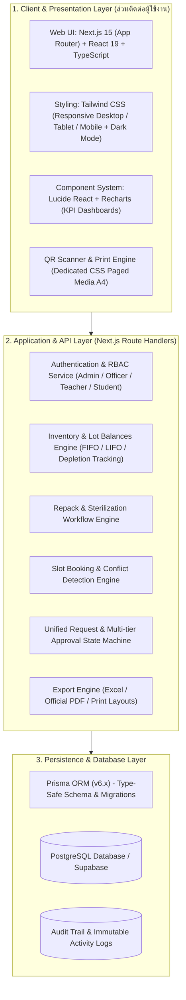
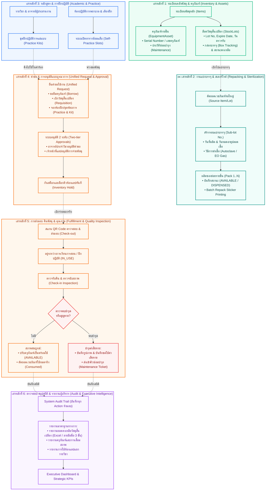
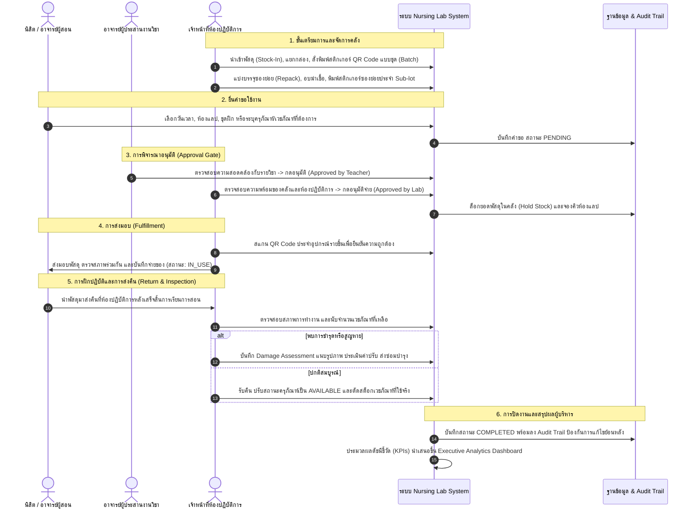

# ภาพรวมสถาปัตยกรรมและการทำงานทั้งระบบ (System Architecture & Operational Overview)
**ระบบบริหารจัดการห้องปฏิบัติการพยาบาล (Nursing Lab Information & Inventory Management System)**  
*คณะพยาบาลศาสตร์ มหาวิทยาลัยเกษตรศาสตร์*

---

## 1. วัตถุประสงค์และภาพรวมระดับสูง (High-Level Purpose)

ระบบห้องปฏิบัติการพยาบาลถูกออกแบบและพัฒนาขึ้นเป็น **Enterprise Web Application แบบครบวงจร (End-to-End)** เพื่อยกระดับการบริหารจัดการห้องปฏิบัติการพยาบาล จากเดิมที่ใช้เอกสารกระดาษหรือสมุดจดบันทึก มาเป็นระบบดิจิทัลที่เชื่อมโยงกันอย่างไร้รอยต่อ ครอบคลุม:
1. **การควบคุมพัสดุและสินทรัพย์แม่นยำ:** แยกชัดเจนระหว่าง **ครุภัณฑ์ (Equipment Assets)** ที่ต้องติดตามประวัติรายชิ้น และ **วัสดุสิ้นเปลือง (Consumables)** ที่บริหารจัดการตามล็อต (Lot/Expiry)
2. **งานแบ่งบรรจุเวชภัณฑ์และการอบฆ่าเชื้อ (Repack & Sterilization):** รองรับการเบิกห่อใหญ่มาจัดชุดซองย่อยปลอดเชื้อ กำหนดรหัส Sub-lot และติดตามรายซอง (Pack 1..N)
3. **การบริการการเรียนการสอนและฝึกทักษะอิสระ:** การเปิดจองรอบซ้อมแล็บ (Self-Practice Slots) และการยื่นคำขอเบิก-ยืมพัสดุแบบบูรณาการ (Unified Request)
4. **ระบบกำกับดูแลและความโปร่งใส (Governance & Auditability):** การอนุมัติหลายระดับ (Multi-tier Approval), การประเมินความเสียหาย/ค่าปรับ, และรายงานผู้บริหารพร้อมบล็อกลงนามทางการ 3 ลำดับขั้น

---

## 2. โครงสร้างสถาปัตยกรรมทางเทคนิค (Technical Architecture Stack)

- **Frontend Framework:** Next.js 15 (App Router) พร้อม React 19, TypeScript และ Tailwind CSS
- **API & Business Logic:** RESTful Route Handlers (`/api/*`) ตรวจสอบความถูกต้องและจัดการ Transaction ผ่าน Server-Side
- **Database & ORM:** PostgreSQL ผ่าน **Prisma ORM (v6.x)** พร้อมการรักษาความสัมพันธ์เชิงข้อมูล (Relational Integrity)
- **Security & Authorization:** Role-Based Access Control (RBAC) แบ่ง 4 บทบาทหลัก:
  - `ADMIN` (ผู้ดูแลระบบสูงสุด)
  - `OFFICER` (เจ้าหน้าที่ห้องปฏิบัติการ)
  - `TEACHER` (อาจารย์ประจำหลักสูตร/ผู้ประสานงานรายวิชา)
  - `STUDENT` (นิสิตพยาบาล)

---

## 3. สถาปัตยกรรม 6 มิติหลักของระบบ (6 Core Architectural Pillars)

---

## 4. วงจรการทำงานตั้งแต่ต้นจนจบ (End-to-End Operational Lifecycle)

---

## 5. จุดเด่นเฉพาะตัวของระบบที่ได้รับการพัฒนาล่าสุด

| ฟังก์ชันงาน | รายละเอียดและการทำงาน | ประโยชน์ต่อองค์กร |
| :--- | :--- | :--- |
| **ระบบแบ่งบรรจุ & ปลอดเชื้อ (`/repack`)** | รองรับการตัดยอดกล่องใหญ่มาแบ่งบรรจุเป็นซองย่อยปลอดเชื้อ กำหนด Sub-lot วันที่หมดอายุ และวิธีอบฆ่าเชื้อ | ลดต้นทุนการซื้อเวชภัณฑ์สำเร็จรูปขนาดเล็ก ควบคุมมาตรฐานความปลอดเชื้อทางการพยาบาล |
| **การพิมพ์สติกเกอร์ทีละหลายรายการ (Batch Sticker Printing)** | พิมพ์สติกเกอร์ QR Code สำหรับกล่องพัสดุ, ครุภัณฑ์, และซองย่อยได้คราวละหลายรายการ พร้อมตัวกรองซองที่เบิกจ่ายแล้วออกอัตโนมัติ และหัวแถบทางการของคณะพยาบาลศาสตร์ มก. | ประหยัดเวลาเจ้าหน้าที่อย่างมหาศาล สั่งพิมพ์ A4 รวดเดียวไม่มีหน้าว่างปน |
| **รายงานยอดคงเหลือวัสดุสิ้นเปลืองทางการ (`/reports`)** | ตารางแจกแจงพัสดุตามหมวดหมู่ คำนวณยอดคงเหลือ มูลค่ารวม ตารางสรุปท้ายหน้า และบล็อกลงนามทางการ 3 ระดับ (ผู้รายงาน, ผู้ตรวจสอบ, ผู้อนุมัติ) พร้อมปุ่ม Export Excel | ใช้เป็นเอกสารตรวจนับพัสดุประจำปีตามระเบียบพัสดุภาครัฐได้ทันที |
| **ระบบจองฝึกทักษะอิสระ (`/practice`)** | จัดสรรห้องปฏิบัติการและเตียงฝึกตาม Slot เวลาที่เปิดให้จอง ป้องกันการชนกันของห้อง (Conflict Detection) พร้อมระบุอาจารย์ผู้ควบคุม | นิสิตฝึกฝนทักษะหัตถการได้อย่างมีประสิทธิภาพ มีความปลอดภัยในการใช้งาน |
| **ระบบความปลอดภัยและการตรวจสอบ (Audit Trail)** | บันทึกประวัติการกระทำ เวลา ผู้ใช้ และค่าก่อน-หลังการเปลี่ยนแปลง ทุกคำขอมีเลขอ้างอิงติดตามได้ | โปร่งใส ตรวจสอบย้อนหลังได้ 100% ป้องกันทุจริตและการสูญหายของพัสดุ |
