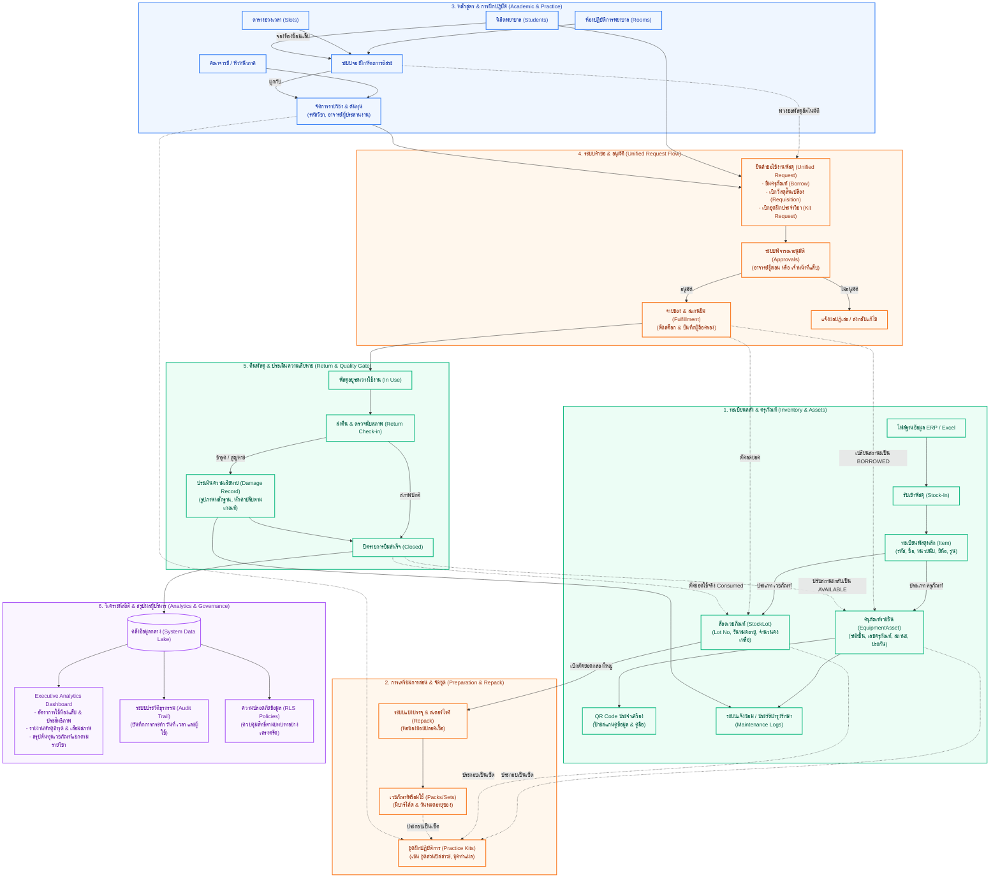

# ผังขั้นตอนการทำงานและความเชื่อมโยงทั้งระบบ (System Operational Flowchart)
**ระบบห้องปฏิบัติการพยาบาล (Nursing Lab Information Management System)**

เอกสารแสดงภาพรวมกระบวนการทำงาน (End-to-End Operational Lifecycle) แบ่งออกเป็น 2 ส่วนหลัก:
1. **ผังขั้นตอนการดำเนินงานแนวตั้ง (Vertical Flowchart)**: แสดงขั้นตอนการปฏิบัติงานจริง จุดตัดสินใจ (Decision Points) เงื่อนไข และการแยกแขนงตามมาตรฐานผังงานสากล
2. **ผังความสัมพันธ์สถาปัตยกรรมระบบ (System Architecture Flow)**: แสดงความเชื่อมโยงของข้อมูล 6 มิติหลักภายในระบบ

---

## 🌟 ส่วนที่ 1: ผังขั้นตอนการปฏิบัติงานทั้งระบบ (Vertical Flowchart)

ผังงานแนวตั้งแสดงวงจรการทำงานตั้งแต่การเข้าสู่ระบบ การจัดการคลัง การยื่นคำร้อง การอนุมัติ การจ่าย-คืนพัสดุ การตรวจนับความเสียหาย ไปจนถึงการประมวลผลดัชนีชี้วัดสู่ผู้บริหาร:

```mermaid
flowchart TD
    %% Styling Definitions
    classDef startEnd fill:#0f172a,stroke:#334155,stroke-width:2.5px,color:#ffffff,font-weight:bold;
    classDef process fill:#ffffff,stroke:#0284c7,stroke-width:2px,color:#0f172a;
    classDef decision fill:#fef3c7,stroke:#d97706,stroke-width:2.5px,color:#92400e,font-weight:bold;
    classDef prep fill:#f0fdf4,stroke:#16a34a,stroke-width:2px,color:#14532d;
    classDef warn fill:#fef2f2,stroke:#dc2626,stroke-width:2px,color:#991b1b;
    classDef audit fill:#faf5ff,stroke:#9333ea,stroke-width:2px,color:#581c87;

    Start([🔵 เริ่มต้น: ผู้ใช้งานเข้าสู่ระบบ Nursing Lab System]):::startEnd
    Auth[🔑 ตรวจสอบยืนยันตัวตนและสิทธิ์การใช้งาน<br/>(Supabase Auth & Role-Based Access Control: RLS)]:::process
    Start --> Auth

    %% STAGE 1
    subgraph S1 ["ขั้นตอนที่ 1: การเตรียมข้อมูลแม่แบบและบริหารคลังพัสดุ (Master Data & Inventory Setup)"]
        CourseSetup[📚 อาจารย์/เจ้าหน้าที่กำหนดรายวิชาและผูกชุดอุปกรณ์แม่แบบ<br/>(Course Setup & Kit Templates)]:::prep
        CheckStock[📦 ตรวจสอบยอดคงคลัง: เวชภัณฑ์ในสต็อกและครุภัณฑ์พร้อมใช้<br/>(Check Consumables & Equipment Assets)]:::prep
        IsStockEnough{ยอดพัสดุในคลัง<br/>เพียงพอหรือไม่?}:::decision
        OrderSupply[⚠️ แจ้งเตือนสต็อกต่ำ & ดำเนินการสั่งซื้อ/รับเข้าพัสดุใหม่<br/>(Low Stock Alert & Procurement)]:::warn
        StockIn[📥 ตรวจรับพัสดุเข้าคลัง บันทึก Lot วันหมดอายุ และติด QR Code<br/>(Stock-In Processing)]:::prep
        PackPrep[✂️ จัดเตรียมเซ็ตฝึกปฏิบัติและแบ่งบรรจุซองสเตอร์ไรด์<br/>(Repack & Set Preparation)]:::prep

        CourseSetup --> CheckStock
        CheckStock --> IsStockEnough
        IsStockEnough -- ❌ ไม่เพียงพอ --> OrderSupply
        OrderSupply --> StockIn
        StockIn --> CheckStock
        IsStockEnough --  เพียงพอ --> PackPrep
    end
    Auth --> CourseSetup

    %% STAGE 2
    subgraph S2 ["ขั้นตอนที่ 2: การยื่นคำร้องและการจองฝึกปฏิบัติ (Request & Booking Submission)"]
        UserSelect[🗓️ ผู้ขอ (นศ./อาจารย์) เลือกรายวิชา ระบุวัน-เวลา ห้องแลป และอุปกรณ์<br/>(Select Course, Time Slot & Required Items)]:::process
        CreateReq[📝 ส่งคำร้องขอเบิกพัสดุ หรือจองฝึกทักษะการพยาบาล<br/>(Submit Material Request / Practice Booking)]:::process
        ReqStatus[⏳ บันทึกคำร้องลงฐานข้อมูล สถานะ: รอดำเนินการ (PENDING)<br/>(Pending Approval Queue)]:::process

        PackPrep --> UserSelect
        UserSelect --> CreateReq
        CreateReq --> ReqStatus
    end

    %% STAGE 3
    subgraph S3 ["ขั้นตอนที่ 3: การตรวจสอบและพิจารณาอนุมัติคำขอ (Review & Approval Process)"]
        ReviewReq[🔍 อาจารย์ผู้รับผิดชอบหรือเจ้าหน้าที่แลปตรวจสอบความถูกต้อง<br/>(Review Request Details & Lab Availability)]:::process
        IsApproved{ผลการพิจารณา<br/>อนุมัติหรือไม่?}:::decision
        RejectReq[🚫 ไม่อนุมัติ: แจ้งเหตุผลปฏิเสธและส่งกลับให้ผู้ขอดำเนินการ<br/>(Rejected / Reason Provided)]:::warn
        ApproveReq[✅ อนุมัติคำขอ: จองคิวห้องแลปและกันยอดพัสดุในระบบทันที<br/>(Approved: Hold Inventory & Reserve Room)]:::process

        ReqStatus --> ReviewReq
        ReviewReq --> IsApproved
        IsApproved -- ❌ ไม่อนุมัติ --> RejectReq
        RejectReq -.->|แก้ไขข้อมูล/ยื่นใหม่| UserSelect
        IsApproved --  อนุมัติ --> ApproveReq
    end

    %% STAGE 4
    subgraph S4 ["ขั้นตอนที่ 4: การจัดเตรียมและส่งมอบอุปกรณ์ (Fulfillment & Check-out)"]
        StaffPick[🛒 เจ้าหน้าที่จัดของตามใบงาน หยิบครุภัณฑ์และเวชภัณฑ์ตามจำนวน<br/>(Staff Pick & Assemble Items)]:::process
        ScanQR[📱 สแกน QR Code ประจำเครื่องเพื่อตรวจสอบความถูกต้องรายชิ้น<br/>(QR Code Verification)]:::process
        Handover[🤝 ส่งมอบอุปกรณ์ให้ผู้ขอ ตรวจสอบสภาพร่วมกันและลงชื่อรับ<br/>(Handover & Sign-off Confirmation)]:::process
        SetInUse[🚀 ระบบปรับสถานะคำร้องเป็น: อยู่ระหว่างใช้งาน (IN_USE)<br/>(Status Updated to IN_USE)]:::process

        ApproveReq --> StaffPick
        StaffPick --> ScanQR
        ScanQR --> Handover
        Handover --> SetInUse
    end

    %% STAGE 5
    subgraph S5 ["ขั้นตอนที่ 5: การฝึกปฏิบัติและการตรวจรับคืน (Practice & Return Inspection)"]
        InPractice[🩺 ดำเนินการเรียนการสอน หรือฝึกทักษะการพยาบาลตามตาราง<br/>(Active Nursing Practice Session)]:::process
        ReturnItem[🔄 นำอุปกรณ์และเวชภัณฑ์ที่เหลือมาส่งคืนที่ห้องปฏิบัติการ<br/>(Return Items to Nursing Lab)]:::process
        InspectItem[🔬 เจ้าหน้าที่ตรวจนับจำนวน ตรวจสภาพการทำงาน และความสะอาด<br/>(Inspection & Count Verification)]:::process
        IsDamaged{พบการชำรุด<br/>เสียหาย หรือสูญหาย?}:::decision

        InPractice --> ReturnItem
        ReturnItem --> InspectItem
        InspectItem --> IsDamaged

        subgraph S5_Damaged ["⚠️ กรณีพบความเสียหายหรือสูญหาย (Damage Handling)"]
            RecordDamage[📋 บันทึกประเมินความเสียหาย (Damage Assessment Record)<br/>ระบุลักษณะอาการ ภาพถ่าย และสาเหตุ]:::warn
            AssessFine[💰 คำนวณค่าปรับ/ค่าชดใช้ตามระเบียบคณะพยาบาลศาสตร์<br/>(Fine & Compensation Assessment)]:::warn
            SendRepair[🛠️ ส่งรายการเข้าคิวแจ้งซ่อม ปรับสถานะเครื่องเป็น MAINTENANCE<br/>(Create Maintenance Ticket)]:::warn
        end

        subgraph S5_Normal [" กรณีสภาพปกติสมบูรณ์ (Normal Return)"]
            AcceptReturn[✨ ยืนยันการรับคืนสำเร็จ ปรับสถานะเครื่องเป็น AVAILABLE พร้อมใช้<br/>(Update Asset to AVAILABLE)]:::prep
            CutStock[📊 ตัดลดยอดเวชภัณฑ์ที่ใช้หมดไปตามจริง (Consumed Stock)<br/>(Update Stock Lot Balances)]:::prep
        end

        IsDamaged -- ⚠️ พบชำรุด/สูญหาย --> RecordDamage
        RecordDamage --> AssessFine
        AssessFine --> SendRepair

        IsDamaged --  ปกติสมบูรณ์ --> AcceptReturn
        AcceptReturn --> CutStock
    end
    SetInUse --> InPractice

    %% STAGE 6
    subgraph S6 ["ขั้นตอนที่ 6: การบันทึกประวัติ สรุปผล และรายงานผู้บริหาร (Audit & Analytics)"]
        CloseReq[🏁 ปิดคำร้องสมบูรณ์ อัปเดตสถานะเป็น: เสร็จสิ้น (COMPLETED)<br/>(Finalize Request)]:::audit
        AuditLog[🔒 บันทึก Audit Trail ทุกการกระทำ เวลา และผู้รับผิดชอบอย่างโปร่งใส<br/>(Immutable System Audit Log)]:::audit
        CalcMetrics[📈 ประมวลผลดัชนีชี้วัด (KPIs): อัตราการใช้ห้อง อุปกรณ์ยอดนิยม ยอดชำรุด<br/>(Compute Strategic Metrics)]:::audit
        ExecDashboard[📊 นำเสนอข้อมูลบน Executive Dashboard สำหรับอาจารย์และผู้บริหาร<br/>(Dean & Faculty Analytics View)]:::audit
        EndNode([🔴 สิ้นสุดกระบวนการทำงาน]):::startEnd

        SendRepair --> CloseReq
        CutStock --> CloseReq
        CloseReq --> AuditLog
        AuditLog --> CalcMetrics
        CalcMetrics --> ExecDashboard
        ExecDashboard --> EndNode
    end
```

---

### 📋 คำอธิบายสัญลักษณ์และขั้นตอนการทำงาน 6 ขั้นตอนหลัก:

| สัญลักษณ์ | ชื่อเรียก | บทบาทและการทำงานในระบบ |
| :--- | :--- | :--- |
| **วงรี/แคปซูล (`([ ... ])`)** | **Terminator** | จุดเริ่มต้น (เข้าสู่ระบบ) และจุดสิ้นสุดกระบวนการ (ปิดคำร้องสมบูรณ์) |
| **สี่เหลี่ยมผืนผ้า (`[ ... ]`)** | **Process** | ขั้นตอนการปฏิบัติงาน เช่น ยื่นคำร้อง, จัดเตรียมของ, สแกน QR Code, การตรวจรับคืน |
| **ข้าวหลามตัด (`{ ... }`)** | **Decision Diamond** | จุดตัดสินใจและตรวจสอบเงื่อนไข มีเส้นแยกตามผลลัพธ์ (ใช่/ไม่ใช่, ผ่าน/ไม่ผ่าน) |
| **กล่องข้อความกลุ่ม (`subgraph`)** | **Process Stage** | การจัดหมวดหมู่ขั้นตอนงานตามวงจรธุรกิจ (Lifecycle Stages) |

#### 1. การเตรียมข้อมูลแม่แบบและบริหารคลังพัสดุ (Master Data & Inventory Setup)
- อาจารย์และเจ้าหน้าที่กำหนดรายวิชาและผูกชุดอุปกรณ์แม่แบบ (Kit Templates)
- ตรวจสอบความพร้อมของพัสดุในคลัง (ครุภัณฑ์ และล็อตเวชภัณฑ์)
- **จุดตัดสินใจ**: หากพัสดุไม่เพียงพอ แจ้งเตือน Low Stock และนำเข้าสู่กระบวนการจัดซื้อ/ตรวจรับใหม่ (Stock-In) หากเพียงพอ ดำเนินการแบ่งบรรจุสเตอร์ไรด์ (Repack) และเตรียมชุดฝึก

#### 2. การยื่นคำร้องและการจองฝึกปฏิบัติ (Request & Booking Submission)
- นักศึกษาหรืออาจารย์ผู้สอนเลือกรายวิชา กำหนดวัน-เวลา และระบุรายการพัสดุ/ห้องแลป
- ส่งคำร้องเข้าสู่ระบบ โดยระบบจะบันทึกสถานะเริ่มต้นเป็น `PENDING`

#### 3. การตรวจสอบและพิจารณาอนุมัติคำขอ (Review & Approval Process)
- อาจารย์ผู้รับผิดชอบรายวิชาหรือเจ้าหน้าที่แลปตรวจสอบความถูกต้องและความพร้อมของห้อง
- **จุดตัดสินใจ**: 
  - **ไม่อนุมัติ**: ระบุเหตุผล และส่งกลับให้ผู้ขอนำไปแก้ไขหรือยกเลิกคำขอ
  - **อนุมัติ**: ปรับสถานะเป็น `APPROVED` พร้อมทั้งล็อกยอดพัสดุในคลังและจองคิวห้องแลปทันที

#### 4. การจัดเตรียมและส่งมอบอุปกรณ์ (Fulfillment & Check-out)
- เจ้าหน้าที่จัดพัสดุตามใบงาน และใช้ระบบสแกน QR Code ประจำอุปกรณ์รายชิ้นเพื่อยืนยันความถูกต้อง
- ส่งมอบอุปกรณ์ให้ผู้ขอ ตรวจสอบสภาพร่วมกัน และลงนามรับในระบบ สถานะปรับเป็น `IN_USE`

#### 5. การฝึกปฏิบัติและการตรวจรับคืน (Practice & Return Inspection)
- ดำเนินการเรียนการสอนหรือฝึกหัตถการตามเวลา เมื่อเสร็จสิ้นนำส่งคืนที่เคาน์เตอร์ห้องปฏิบัติการ
- เจ้าหน้าที่ตรวจนับจำนวน ตรวจสภาพการทำงาน และความสะอาด
- **จุดตัดสินใจ**:
  - **กรณีพบชำรุด/สูญหาย**: บันทึกประเมินความเสียหาย (Damage Assessment) -> คำนวณค่าปรับตามระเบียบคณะ -> ปรับสถานะเครื่องเข้าคิวซ่อม (MAINTENANCE)
  - **กรณีสภาพปกติสมบูรณ์**: รับคืนสำเร็จ ปรับสถานะเครื่องเป็นพร้อมใช้ (AVAILABLE) -> ตัดลดยอดเวชภัณฑ์ที่ใช้หมดไปตามจริง (Consumed Stock)

#### 6. การบันทึกประวัติ สรุปผล และรายงานผู้บริหาร (Audit & Analytics)
- ปิดคำร้องสมบูรณ์ (`COMPLETED`)
- บันทึกประวัติการทำรายการลง Audit Trail ป้องกันการแก้ไขย้อนหลัง
- ประมวลผลดัชนีชี้วัด (KPIs) และนำเสนอข้อมูลบน Executive Dashboard สำหรับคณบดีและหัวหน้าสาขา

---

## 🏛️ ส่วนที่ 2: ผังความสัมพันธ์สถาปัตยกรรมระบบ (System Architecture Flow)

แผนภาพแสดงความเชื่อมโยงและการไหลเวียนของข้อมูลระหว่างโมดูลฐานข้อมูล 6 มิติ:



---

### 📁 ไฟล์เอกสารและรูปภาพที่เกี่ยวข้องในโปรเจกต์:
- **โฟลเดอร์รวบรวมไฟล์:** [d:\LAB-system\system_flow](file:///d:/LAB-system/system_flow)
  - 🖼️ [ผังขั้นตอนการทำงานทั้งระบบ_System_Flowchart.png](file:///d:/LAB-system/system_flow/ผังขั้นตอนการทำงานทั้งระบบ_System_Flowchart.png)
  - 📕 [ผังขั้นตอนการทำงานทั้งระบบ_System_Flowchart.pdf](file:///d:/LAB-system/system_flow/ผังขั้นตอนการทำงานทั้งระบบ_System_Flowchart.pdf)
  - 📑 [ผังขั้นตอนการทำงานทั้งระบบ_System_Flowchart.docx](file:///d:/LAB-system/system_flow/ผังขั้นตอนการทำงานทั้งระบบ_System_Flowchart.docx)
  - 🌐 [system_operational_flowchart.html](file:///d:/LAB-system/system_flow/system_operational_flowchart.html)
