# แผนภาพความเชื่อมโยงทั้งระบบแบบบูรณาการ (End-to-End System Relationship Architecture)
## ระบบบริหารจัดการห้องปฏิบัติการพยาบาล (Nursing Lab System)

เอกสารฉบับนี้อธิบาย **โครงสร้างความเชื่อมโยงของระบบทั้งระบบ (System Architecture & Operational Matrix)** ครอบคลุมการทำงานร่วมกันระหว่างผู้ใช้งานทุกบทบาท, ทะเบียนพัสดุและผังจัดเก็บ, วงจรชีวิตของเอกสารคำขอ, ศูนย์แจ้งเตือนแบบเรียลไทม์ และระบบการวิเคราะห์ข้อมูล

---

### 1. แผนผังความเชื่อมโยงเชิงสถาปัตยกรรม (Architecture & Flow Diagram)

```mermaid
flowchart TD
    %% Styling Configuration
    classDef roleBox fill:#1e293b,stroke:#38bdf8,stroke-width:2px,color:#ffffff,font-weight:bold;
    classDef masterBox fill:#0f172a,stroke:#14b8a6,stroke-width:2px,color:#ffffff;
    classDef opBox fill:#1e293b,stroke:#fbbf24,stroke-width:2px,color:#ffffff;
    classDef notifBox fill:#1e293b,stroke:#f43f5e,stroke-width:2px,color:#ffffff,font-weight:bold;
    classDef dbBox fill:#0f172a,stroke:#818cf8,stroke-width:2px,color:#ffffff;
    classDef successBox fill:#064e3b,stroke:#34d399,stroke-width:2px,color:#ffffff;

    %% -------------------------------------------------------------
    %% 1. ACTORS & INGRESS LAYER
    %% -------------------------------------------------------------
    subgraph Layer1 [" มิติที่ 1: ผู้ใช้งานและสิทธิ์การเข้าถึง (Roles & Ingress Layer) "]
        direction LR
        U_Student["🎓 นิสิต (STUDENT)<br/>• ยื่นคำขอยืม-เบิก<br/>• จองห้องฝึกปฏิบัติการ<br/>• สแกน QR ตู้/ห้องดูของ"]:::roleBox
        U_Teacher["👩‍🏫 อาจารย์ (TEACHER)<br/>• รับทราบคำขอตามรายวิชา<br/>• Email Quick-Action 1 คลิก<br/>• ตรวจสอบงบประมาณวิชา"]:::roleBox
        U_Officer["🔬 เจ้าหน้าที่แล็บ (OFFICER)<br/>• ตรวจสอบและอนุมัติคำขอ<br/>• จ่าย-รับคืนพัสดุ (POS)<br/>• บริหารตู้และห้องจัดเก็บ"]:::roleBox
        U_Admin["⚙️ ผู้ดูแลระบบ (ADMIN)<br/>• จัดการผู้ใช้และรายวิชา<br/>• ตรวจสอบ Audit Log<br/>• สำรองข้อมูลระบบ"]:::roleBox
    end

    %% -------------------------------------------------------------
    %% 2. MASTER DATA & STORAGE HIERARCHY
    %% -------------------------------------------------------------
    subgraph Layer2 [" มิติที่ 2: คลังพัสดุและผังตำแหน่งจัดเก็บ (Master Repositories & Storage Hierarchy) "]
        direction TB
        subgraph StorageHierarchy [" ผังโครงสร้างจัดเก็บ 3 ระดับ (Storage Hierarchy) "]
            Room["🏢 ห้องแล็บ (Room)<br/>รหัสห้อง / ป้าย QR ประจำห้อง"]
            Cabinet["🗄️ ตู้/โซน (Cabinet)<br/>รหัสตู้ / ป้าย QR ประจำตู้"]
            Shelf["📦 ชั้นวาง (Shelf/Bin)<br/>พิกัดย่อยระบุตำแหน่ง"]
            Room --> Cabinet --> Shelf
        end

        subgraph ItemMaster [" ทะเบียนพัสดุหลัก (Item Master) "]
            Asset["🏷️ ครุภัณฑ์ (Assets)<br/>Asset Code + QR ประจำชิ้น"]
            Consumable["🧪 วัสดุสิ้นเปลือง (Consumables)<br/>Stock Lots + วันหมดอายุ"]
            Repack["✂️ แบ่งบรรจุปลอดเชื้อ (Repack)<br/>ซองย่อย + Sub-lot สเตอร์ไรด์"]
            Consumable --> Repack
        end

        PracticeKit["🧰 ชุดฝึกปฏิบัติการ (Practice Kits)<br/>รวมครุภัณฑ์ + วัสดุสำหรับแต่ละหัตถการ"]
        Asset --> PracticeKit
        Repack --> PracticeKit
        Shelf -.->|เก็บอยู่ที่| Asset
        Shelf -.->|เก็บอยู่ที่| Consumable
    end

    %% -------------------------------------------------------------
    %% 3. OPERATIONAL WORKFLOWS
    %% -------------------------------------------------------------
    subgraph Layer3 [" มิติที่ 3: กระบวนการดำเนินงานและวงจรคำขอ (Operational Workflows & POS) "]
        direction TB
        subgraph IngressTracks [" ช่องทางการยื่นคำขอของนิสิต "]
            Req_Unified["📋 คำขอเบิก-ยืมแบบรวมชุด<br/>(Unified Borrow & Requisition)"]:::opBox
            Req_Booking["📅 คำขอจองห้องฝึกปฏิบัติการ<br/>(Nursing Practice Booking)"]:::opBox
        end

        subgraph ReviewCenter [" ศูนย์พิจารณาและอนุมัติ 2 ระดับ (Decoupled Approvals) "]
            Ack_Step["1️⃣ อาจารย์ผู้สอนกดรับทราบ (ACK)<br/>(ในระบบ หรือผ่านลิงก์ในอีเมล)"]
            Approve_Step["2️⃣ เจ้าหน้าที่แล็บตรวจสอบสต็อกและอนุมัติ (APPROVE)<br/>(ระบบล็อกยอดพัสดุและจองสล็อตเวลา)"]
            Ack_Step --> Approve_Step
        end

        subgraph FulfillmentTrack [" การส่งมอบและการฝึกปฏิบัติ "]
            POS_Dispense["🛒 จุดจ่ายพัสดุ (Check-out)<br/>สแกน QR Code ตรวจรับมอบ"]:::opBox
            Lab_Session["🏥 การฝึกปฏิบัติจริงในห้องแล็บ<br/>สแกน Secure QR เช็คอิน & จับเวลาจริง"]:::opBox
            POS_Return["🔄 การรับคืนพัสดุ (Return)<br/>ตรวจสภาพชำรุด / ส่งซ่อมบำรุง"]:::opBox
            POS_Dispense --> Lab_Session --> POS_Return
        end

        Req_Unified --> ReviewCenter
        Req_Booking --> ReviewCenter
        Approve_Step --> POS_Dispense
    end

    %% -------------------------------------------------------------
    %% 4. NOTIFICATION & COMMUNICATION
    %% -------------------------------------------------------------
    subgraph Layer4 [" มิติที่ 4: การแจ้งเตือนแบบเรียลไทม์ (Notification & Communication Engine) "]
        direction TB
        Notif_Bell["🔔 กระดิ่งแจ้งเตือน Navbar<br/>(Unread Badge + แถบกรอง + ปุ่มอ่านทั้งหมด)"]:::notifBox
        Deep_Link["🚀 Direct Deep Linking<br/>คลิกแล้ววาร์ปตรงสู่หน้ารายการทันที"]:::notifBox
        Email_Engine["✉️ Resend Email Service<br/>ส่งอีเมลพร้อม HMAC Signed Quick Action"]:::notifBox
        Watchdog["⏰ Automated System Watchdog<br/>ตรวจจับของเลยกำหนดส่ง & ของใกล้หมดอายุ 30 วัน"]:::notifBox

        Notif_Bell --> Deep_Link
    end

    %% -------------------------------------------------------------
    %% 5. DATABASE & AUDIT / ANALYTICS
    %% -------------------------------------------------------------
    subgraph Layer5 [" มิติที่ 5: ฐานข้อมูลและการวิเคราะห์กำกับดูแล (Data Ledger & Intelligence) "]
        direction LR
        DB_Supabase[(🗄️ Supabase PostgreSQL<br/>Prisma Client ORM)]:::dbBox
        Analytics["📊 Course Cost & Room Utilization<br/>วิเคราะห์งบประมาณและอัตราการครองห้อง"]:::successBox
        Audit_Logs["📑 Inventory Reconcile & Audit Logs<br/>บันทึกประวัติการปรับยอดและการใช้งาน"]:::successBox
    end

    %% -------------------------------------------------------------
    %% CROSS-LAYER RELATIONSHIPS & TRIGGERS
    %% -------------------------------------------------------------
    U_Student -->|1. ยื่นคำขอ| IngressTracks
    IngressTracks -->|สร้างรายการ PENDING| DB_Supabase
    DB_Supabase -.->|Trigger แจ้งเตือน| Layer4

    Layer4 -->|แจ้งเตือนอาจารย์ & เจ้าหน้าที่| U_Teacher
    Layer4 -->|แจ้งเตือนอาจารย์ & เจ้าหน้าที่| U_Officer
    U_Teacher -->|กดรับทราบ| Ack_Step
    U_Officer -->|กดอนุมัติ| Approve_Step

    Approve_Step -->|Trigger อัปเดต| Layer4
    Layer4 -->|แจ้งเตือนผลการอนุมัติ| U_Student

    POS_Return -->|ตัดยอดคงคลัง / คืนสถานะ| ItemMaster
    POS_Return -->|บันทึกสถิติ| Analytics
    POS_Return -->|บันทึกประวัติ| Audit_Logs
    Watchdog -.->|ตรวจจับอัตโนมัติ| DB_Supabase
```



---

### 2. สรุปความสัมพันธ์เชิงปฏิสัมพันธ์ (Interaction Matrix)

| เหตุการณ์ (Trigger Event) | ผู้กระทำ (Actor) | ผลกระทบต่อคลัง/ข้อมูล (Data Impact) | การแจ้งเตือน (Notifications) | ลิงก์นำทางด่วน (Deep Link) |
|---|---|---|---|---|
| **ยื่นคำขอยืม-เบิกแบบรวมชุด** | นิสิต | บันทึกคำขอสถานะ `PENDING`, ตรวจสอบสต็อกพร้อมใช้ | แจ้งเตือนอาจารย์ผู้สอนประจำวิชา และเจ้าหน้าที่แล็บ | `/approvals` |
| **อาจารย์กดรับทราบ** | อาจารย์ | อัปเดต `acknowledgedAt`, ส่งต่อให้เจ้าหน้าที่พิจารณา | แจ้งเตือนนิสิต และเจ้าหน้าที่แล็บ | `/approvals` หรือ `/borrow` |
| **เจ้าหน้าที่อนุมัติคำขอ** | เจ้าหน้าที่ | อัปเดต `status = APPROVED`, ล็อกยอดพัสดุและคิวห้อง | แจ้งเตือนนิสิต พร้อมเตรียมอุปกรณ์ | `/borrow` หรือ `/requisitions` |
| **สแกนจ่ายพัสดุ (Check-out)** | เจ้าหน้าที่ | ตัดสต็อก Lot, เปลี่ยนสถานะเป็น `IN_USE` / `DISPENSED` | แจ้งเตือนนิสิตเพื่อตรวจรับของ | `/borrow` |
| **จองห้องฝึกปฏิบัติการ** | นิสิต | บันทึก `PracticeBooking`, สร้าง `qrCodeToken` | แจ้งเตือนอาจารย์และเจ้าหน้าที่ | `/practice/bookings` |
| **สแกนเช็คอินเข้าห้องฝึก** | นิสิต/เจ้าหน้าที่ | บันทึก `checkInTime`, ตรวจสอบเงื่อนไขไม่เกิน 30 นาทีก่อนเริ่ม | แจ้งเตือนนิสิตยืนยันการเข้าห้อง | `/practice/my-bookings` |
| **สแกนเช็คเอาท์ห้องฝึก** | นิสิต/เจ้าหน้าที่ | บันทึก `checkOutTime`, คำนวณเวลาฝึกจริง (`actualMinutes`) | แจ้งเตือนนิสิตสรุปเวลาการฝึก | `/practice/my-bookings` |
| **ตรวจพบพัสดุเลยกำหนดส่งคืน** | System Watchdog | ค้นหาคำขอยืมที่เลย `expectedReturnDate` | แจ้งเตือนเจ้าหน้าที่และนิสิตผู้ยืม | `/borrow` |
| **ตรวจพบล็อตพัสดุใกล้หมดอายุ** | System Watchdog | ค้นหา StockLot ที่จะหมดอายุใน 30 วัน | แจ้งเตือนเจ้าหน้าที่แล็บ | `/inventory` |

---

### 3. โครงสร้างตำแหน่งจัดเก็บแบบลำดับชั้น (Storage Hierarchy)
```
[ห้องปฏิบัติการ Room: LAB-401]
   ├── [ตู้จัดเก็บ Cabinet: ตู้ A (ตู้กระจกเก็บหัตถการ)] -> QR Code: /storage/CAB-401-A
   │      ├── [ชั้นวาง Shelf: ชั้น 1] -> เข็มฉีดยา Syringe, สำลี Sterile Repack
   │      └── [ชั้นวาง Shelf: ชั้น 2] -> โมเดลฝึกฉีดยา Injection Arm Model (Assets)
   └── [ตู้จัดเก็บ Cabinet: ตู้ B (ตู้เวชภัณฑ์ควบคุม)] -> QR Code: /storage/CAB-401-B
          ├── [ชั้นวาง Shelf: ชั้น 1] -> ชุดตรวจน้ำตาลในเลือด Glucometer
          └── [ชั้นวาง Shelf: ชั้น 2] -> สายสวนปัสสาวะ Foley Catheter Sets
```

---

### 4. มาตรฐานและความสอดคล้องตามข้อกำหนดระบบ (System Compliance)
1. **Terminology Policy**: ใช้คำว่า **"นิสิต"** อย่างเคร่งครัด 100% ทุกส่วน (ไม่ใช้คำต้องห้ามเด็ดขาด)
2. **Zero Sidebar Clutter**: เมนูหลักบน Sidebar คงเดิมอย่างเป็นระเบียบ โดยปุ่มแจ้งเตือนและ Deep Linking ทำงานผ่านกระดิ่งบน Navbar
3. **Database Integrity**: ฐานข้อมูล Supabase Cloud PostgreSQL พร้อมใช้งาน สอดคล้องกับ Prisma Client ล่าสุด
